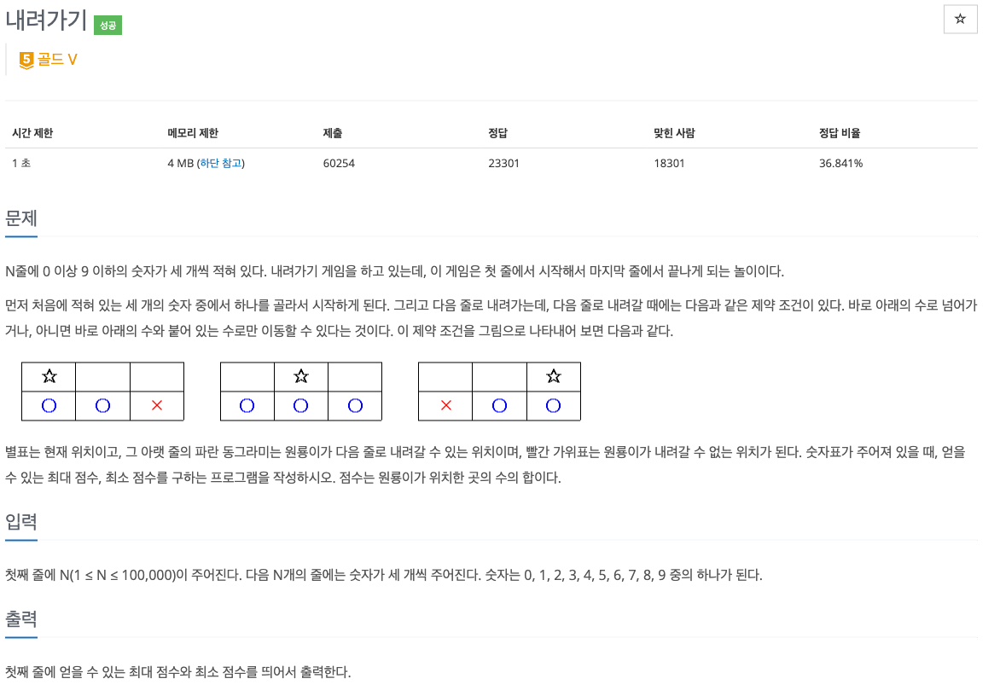
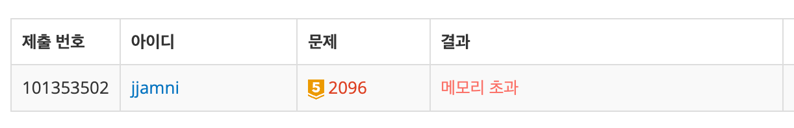
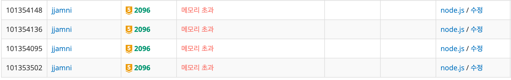
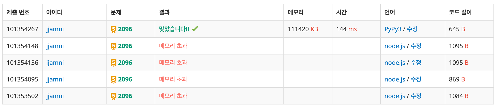

## 🔗 문제 링크

https://www.acmicpc.net/problem/2096

## 💬 문제


DP 문제인데, 최솟값과 최댓값을 둘 다 구해야하는 문제다.

## 🤔 접근

DP로 접근해서 접근 가능한 이전 줄 값들에 현재 줄 값을 더한다.

이후 최소, 최대값을 갱신하여 저장하는 방식으로 접근하고자 했다.

## ✏️ 해결

### 1. DP 배열로 풀기

처음엔 메모리 제한을 못 보고, minDP와 maxDP 배열을 만들어 풀어보고자 했다.

한 줄당 3개의 칸만 있어, 하나하나 계산하여 DP 배열을 갱신했다.

```js
const input = require('fs').readFileSync('/dev/stdin').toString().split('\n');

const N = Number(input[0]);

const arr = [];
const minArr = Array.from({ length: N }, () => Array(3).fill(0));
const maxArr = Array.from({ length: N }, () => Array(3).fill(0));

for (let i = 1; i <= N; i++) {
  arr.push(input[i].split(' ').map(Number));
}

for (let i = 0; i < 3; i++) {
  minArr[0][i] = arr[0][i];
  maxArr[0][i] = arr[0][i];
}

for (let i = 1; i < N; i++) {
  minArr[i][0] = Math.min(minArr[i - 1][0], minArr[i - 1][1]) + arr[i][0];
  maxArr[i][0] = Math.max(maxArr[i - 1][0], maxArr[i - 1][1]) + arr[i][0];

  minArr[i][1] = Math.min(minArr[i - 1][0], minArr[i - 1][1], minArr[i - 1][2]) + arr[i][1];
  maxArr[i][1] = Math.max(maxArr[i - 1][0], maxArr[i - 1][1], maxArr[i - 1][2]) + arr[i][1];

  minArr[i][2] = Math.min(minArr[i - 1][1], minArr[i - 1][2]) + arr[i][2];
  maxArr[i][2] = Math.max(maxArr[i - 1][1], maxArr[i - 1][2]) + arr[i][2];
}

let min = Math.min(...minArr[N - 1]);
let max = Math.max(...maxArr[N - 1]);

console.log(max + ' ' + min);
```

결과는 ... 메모리 초과 !!


### 2. 배열 없이 변수 초기화해가며 풀기

배열의 크기가 너무 커서 메모리 초과가 났다고 생각했다.

따라서 값 별로 각각 변수를 만들고, 새로운 값을 덮었는 방식으로 접근해보았다.

```js
const input = require('fs').readFileSync('/dev/stdin').toString().split('\n');

const N = Number(input[0]);

let min0 = 0,
  min1 = 0,
  min2 = 0;
let max0 = 0,
  max1 = 0,
  max2 = 0;

for (let i = 1; i <= N; i++) {
  const [a, b, c] = input[i].split(' ').map(Number);

  if (i === 1) {
    min0 = max0 = a;
    min1 = max1 = b;
    min2 = max2 = c;
    continue;
  }

  const nMin0 = Math.min(min0, min1) + a;
  const nMin1 = Math.min(min0, min1, min2) + b;
  const nMin2 = Math.min(min1, min2) + c;

  const nMax0 = Math.max(max0, max1) + a;
  const nMax1 = Math.max(max0, max1, max2) + b;
  const nMax2 = Math.max(max1, max2) + c;

  min0 = nMin0;
  min1 = nMin1;
  min2 = nMin2;

  max0 = nMax0;
  max1 = nMax1;
  max2 = nMax2;
}

const min = Math.min(min0, min1, min2);
const max = Math.max(max0, max1, max2);

console.log(max + ' ' + min);
```

이또한,,, 메모리 초과 !!!!!

### 3. 입력을 한 줄씩 처리하기

이전에 이중 우선순위 큐 문제 풀 때, input을 하나의 변수에 가지고 있는게 메모리 초과가 났던 기억이 났다. 그래서 한 줄씩 입력을 처리받아 바로바로 풀어보았다..!!

```js
const readline = require('readline');

const rl = readline.createInterface({
  input: process.stdin,
  output: process.stdout,
});

let N = 0;
let lineIdx = 0;

let min0 = 0,
  min1 = 0,
  min2 = 0;
let max0 = 0,
  max1 = 0,
  max2 = 0;

rl.on('line', (line) => {
  if (lineIdx === 0) {
    N = Number(line);
    lineIdx++;
    return;
  }

  const [a, b, c] = line.split(' ').map(Number);

  if (lineIdx === 1) {
    min0 = max0 = a;
    min1 = max1 = b;
    min2 = max2 = c;
  } else {
    const nMin0 = Math.min(min0, min1) + a;
    const nMin1 = Math.min(min0, min1, min2) + b;
    const nMin2 = Math.min(min1, min2) + c;

    const nMax0 = Math.max(max0, max1) + a;
    const nMax1 = Math.max(max0, max1, max2) + b;
    const nMax2 = Math.max(max1, max2) + c;

    min0 = nMin0;
    min1 = nMin1;
    min2 = nMin2;

    max0 = nMax0;
    max1 = nMax1;
    max2 = nMax2;
  }

  lineIdx++;

  if (lineIdx > N) rl.close();
});

rl.on('close', () => {
  const min = Math.min(min0, min1, min2);
  const max = Math.max(max0, max1, max2);
  console.log(max + ' ' + min);
});
```

완벽하다고 생각했는데.. 이 역시 메모리 초과가 났다 !!!!!


## ⚠️ 문제

구글에 나와 같은 문제를 겪는 사람이 있나 검색해보았다.

BOJ의 메모리 제한으로 인해 이 문제는 node.js로 풀 수 없는 문제였다..

따라서 파이썬으로 풀어보았다.

```python
import sys
input = sys.stdin.readline

N = int(input().strip())

min0 = min1 = min2 = 0
max0 = max1 = max2 = 0

for i in range(N):
    a, b, c = map(int, input().split())

    if i == 0:
        min0 = max0 = a
        min1 = max1 = b
        min2 = max2 = c
    else:
        nMin0 = min(min0, min1) + a
        nMin1 = min(min0, min1, min2) + b
        nMin2 = min(min1, min2) + c

        nMax0 = max(max0, max1) + a
        nMax1 = max(max0, max1, max2) + b
        nMax2 = max(max1, max2) + c

        min0, min1, min2 = nMin0, nMin1, nMin2
        max0, max1, max2 = nMax0, nMax1, nMax2

print(max(max0, max1, max2), min(min0, min1, min2))
```

오랜만에 파이썬을 써봤는데, 좀 어색하면서도 코드가 깔끔해보여서 기분이 좋았다.



## 🤔 깨달은 점

node.js로는 풀 수 없는 문제여서 처음엔 뭐 이런게 다 있어 하고 분노했지만, 한 방법으로 막혔을 때 다른 방법이 바로바로 떠올랐다.

배열 DP -> 변수 갱신 -> 입력 스트림 처리 -> 언어 변경

한 번에 문제가 풀리지 않더라도 다른 방법 없을까 하고 고민하고, 포기하지 않고 새로운 방법으로 풀고자 했다는게 뭔가 뿌듯했다.

## ✅ 전체 코드

```python
import sys
input = sys.stdin.readline

N = int(input().strip())

min0 = min1 = min2 = 0
max0 = max1 = max2 = 0

for i in range(N):
    a, b, c = map(int, input().split())

    if i == 0:
        min0 = max0 = a
        min1 = max1 = b
        min2 = max2 = c
    else:
        nMin0 = min(min0, min1) + a
        nMin1 = min(min0, min1, min2) + b
        nMin2 = min(min1, min2) + c

        nMax0 = max(max0, max1) + a
        nMax1 = max(max0, max1, max2) + b
        nMax2 = max(max1, max2) + c

        min0, min1, min2 = nMin0, nMin1, nMin2
        max0, max1, max2 = nMax0, nMax1, nMax2

print(max(max0, max1, max2), min(min0, min1, min2))
```

```toc

```
