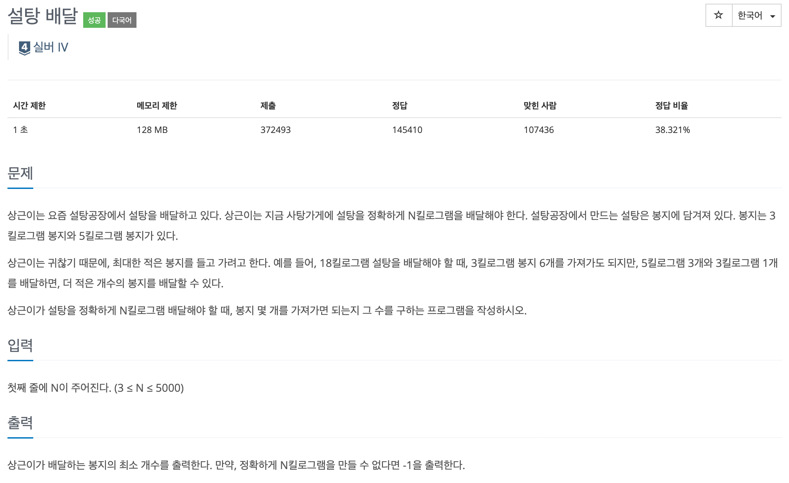

## 🔗 문제 링크

https://www.acmicpc.net/problem/2839

## 💬 문제


정수 n이 주어졌을 때, 해당 수를 3과 5로 묶을 수 있는 최소한의 묶음 수를 구하는 문제이다. 탐욕 알고리즘을 사용해야할 것 같다.

## 🤔 접근

탐욕 알고리즘 공부 중 마주한 문제라 당연히 해당 방법으로 푸는줄로만 알고 첫 접근을 이상하게 했다.

내가 알았던 탐욕 알고리즘(잘못됨) : 우선 제일 큰 것부터 이용해서 묶고 안되면 다시 돌아가서 해결하면 되는거 아니야?

이 잘못된 생각에 꽂혀 1시간동안 삽질했다..

```txt
5로 최대한 묶음 -> 나누어 떨어지나
? 출력
: 3으로 최대한 묶음 -> 나누어 떨어지나
  ? 출력
  : 다 엎고 처음부터 3으로 최대한 묶음 -> 나누어 떨어지나
    ? 출력
    : -1 출력
```

ㅋㅋㅋ .. 쓰면서도 어이가 없고 지금 어지러울 정도임 너무 멘탈이 나갔다.. 사실 해결될 만도 한데 코드 짜면서도 뭔가 잘못됨이 계속 멤돌아서 해설 영상을 보았다.

## ✏️ 해결

바보같은 나 .. 해결방법은 다음과 같다.

1. n이 0보다 크거나 같은 동안 계속 루프를 돈다.
2. n을 3으로 빼며 묶음 개수를 증가시킨다.
3. n이 0이거나 5로 나누어 떨어지면 5로 나누어 떨어지는 만큼 묶음 개수에 더하고 출력한다.
4. 답이 없는 경우는 flag 변수를 통해 컨트롤한다.

3을 먼저 뺄 생각을 전혀 하지 못했다. 탐욕 알고리즘이라길래 무조건 큰거부터 해결하는 건줄 알았지ㅡㅡ(~~아님~~)

아무튼 아래는 전체 코드이다. while문에서 n을 계속 감시하며 3을 빼주고, 0이 되거나 5로 나누어 떨어지는 수가 되는 순간 해당 값을 처리 후 반복문을 빠져나간다.

if문을 통해 반복문을 빠져나간 경우는 문제 해결이기 때문에 flag를 true로 바꿔주고, while문이 종료된 경우(3을 뺐는데 0이 아닌 -1,-2가 나오는 경우)는 3과 5로 묶을 수 없는 경우기 때문에 -1이 출력되게끔 한다.

## ✅ 전체 코드

```js
let input = require('fs').readFileSync('/dev/stdin').toString().split('\n');

let n = Number(input[0]);
let flag = false;
let count = 0;

while (n >= 0) {
  if (n == 0 || n % 5 == 0) {
    count += parseInt(n / 5);
    console.log(count);
    flag = true;
    break;
  }
  n -= 3;
  count++;
}

if (!flag) {
  console.log(-1);
}
```

탐욕 알고리즘 = 항상 큰 수부터? 🤔 꼭 그렇지만은 않다!!

난 바보 .. 어쨌든 성장했다 화이팅

```toc

```
