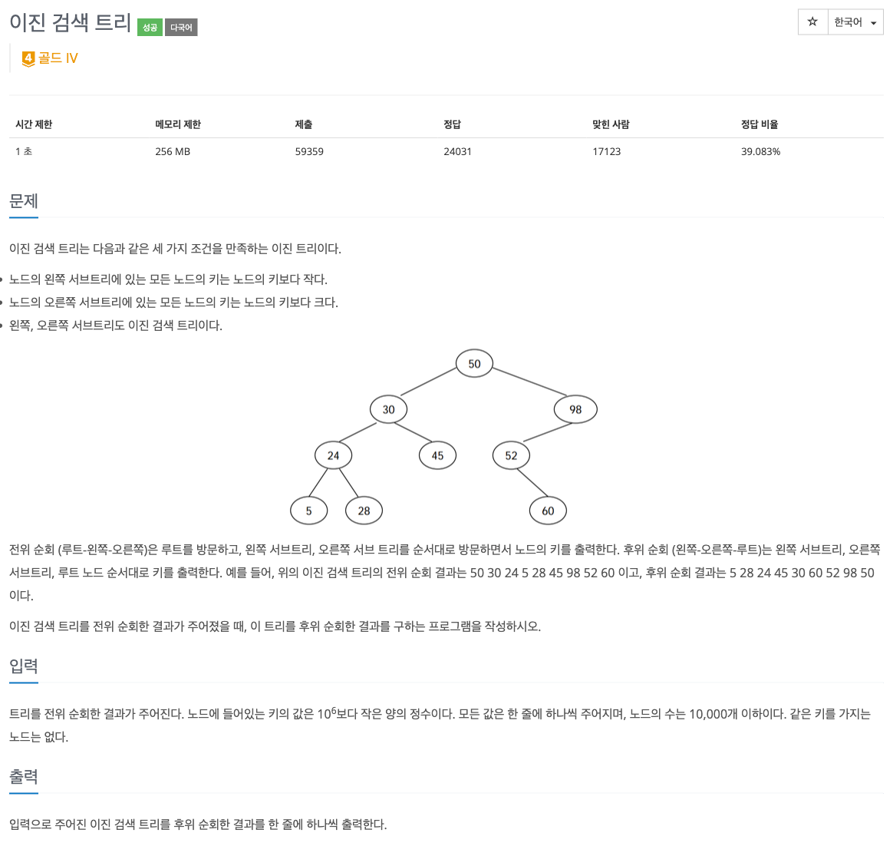
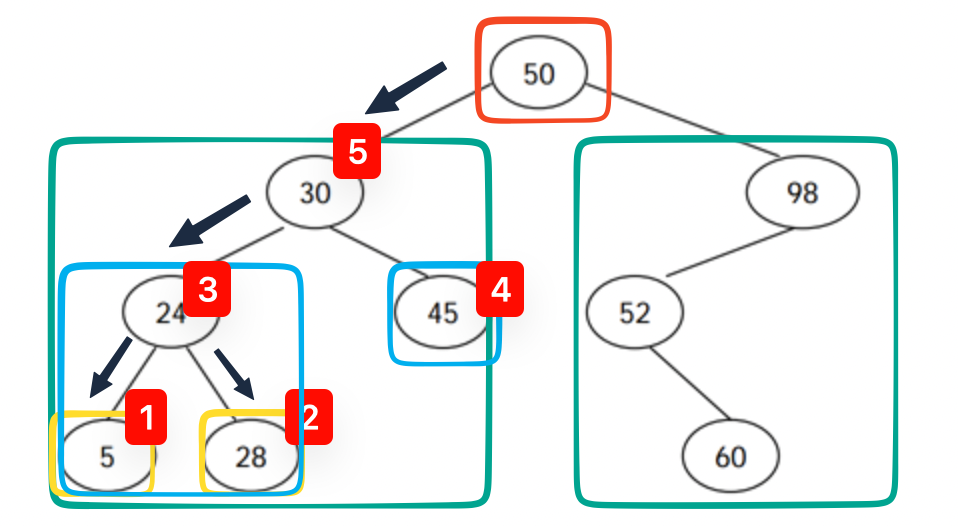
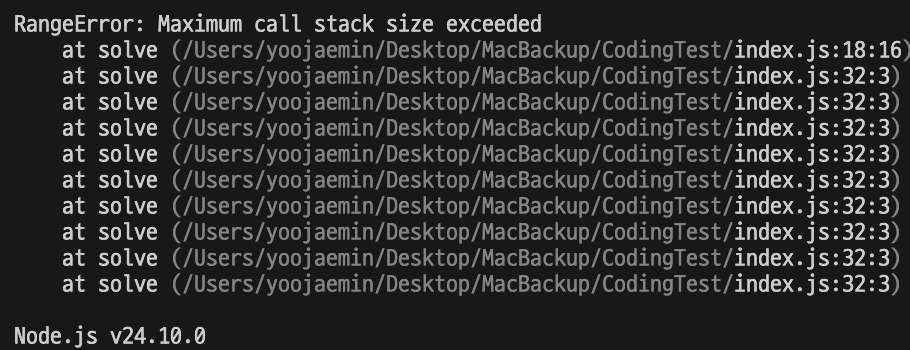

## 🔗 문제 링크

https://www.acmicpc.net/problem/5639

## 💬 문제


이진 탐색 트리의 전위 순회 결과가 주어졌을 때, 해당 트리의 후위 순회 결과를 출력하는 문제다.

## 🤔 접근

전위 순회 결과가 주어졌으니, 그걸 토대로 트리를 만들고 후위 순회를 하며 결과를 출력하면 되겠다! 라고 생각했다.

시간이 1초라서 조금 더 빠른 방법이 없나 생각해보다가, 문제에서 주어진 이진 탐색 트리의 특징을 자세히 보았다.

`왼쪽, 오른쪽 서브트리도 이진 검색 트리이다.`

루트를 기준으로 왼쪽도, 오른쪽도 이진 검색 트리니까 두 서브트리를 재귀적으로 나눠 내려간 후, 마지막에 루트 노드를 출력하게 되면 그게 후위 순회 결과였다!


그림과 같이 루트를 기준으로 좌측 - 우측 순서로 서브트리를 탐색하고, 리프노드에 도달하면 출력한다. 그 결과는 트리의 후위 순회 결과와 같다.

순서는 다음과 같다.

0. 입력을 배열에 저장한다.
1. 배열의 첫 원소는 루트이다.
2. 이후 인덱스부터 순회하며 루트보다 큰 값이 나오면 쪼갠다.
3. 쪼개진 서브트리(왼쪽, 오른쪽) 에 대해 1~2 를 수행한다.
4. 루트를 출력한다.(후위 순회이기 때문!!)

## ⚠️ 문제

solve(start,end) 라는 재귀함수를 만들어 분할 정복을 수행하고 있는데, 무한 루프에 빠졌다..


## ✏️ 해결

### 1. 탈출 조건 문제

우선 재귀함수의 탈출 조건에서 문제를 찾아보았다.

서브트리가 없는 루트의 경우(리프노드인 경우), 위 2의 과정에서 쪼개는 인덱스가 이상해진다. (start > end 가 되어버림)

위의 경우 return 하도록 코드를 추가해줬다.

```js
if (start > end) return;
```

### 2. 완전 이진 트리가 아닌 경우

이진 탐색 트리는 항상 왼쪽, 오른쪽 자식 모두를 갖지 않는다. 예를 들어 왼쪽으로 자식이 쭉 있는 경우, 2의 과정에서 루트보다 큰 노드가 나오지 않는다

예시 입력: 10 8 4

1. root = 10;
2. idx == 1; 10 > 8; idx++;
3. idx == 2; 10 > 4; idx++;
4. idx == 3; tree[3] === undefined => error

이런 상황이 발생할 수 있는 것이다!!
이를 위해 서브트리를 나누는 인덱스를 찾는 반복문에, 가드를 추가해준다.

```js
let idx = start + 1;

while (idx <= end && tree[idx] < root) {
  idx++;
}
```

위 두 가지를 해결하니, 정답을 받을 수 있었다.

## 🤔 깨달은 점

1. 이진 탐색 트리는 완전 이진 트리가 아니다. 한쪽 자식 노드가 없는 경우를 대비하는 가드를 항상 생각하자!
2. 재귀함수에서는 함수 탈출 조건이 항상 중요하다.

재귀함수는 dfs 문제를 해결할 때에만 주로 풀었는데(이것도 dfs긴 하지만), 사묻 다른 느낌이어서 푸느라 재밌었다.

## ✅ 전체 코드

```js
//이진 검색 트리 #5639
const input = require('fs').readFileSync('/dev/stdin').toString().trim().split('\n');

const tree = [];
let line = 0;

while (true) {
  const node = input[line++];

  if (!node) break;

  tree.push(Number(node));
}

answer = [];

function solve(start, end) {
  if (start > end) return;

  const root = tree[start];

  let idx = start + 1;

  while (idx <= end && tree[idx] < root) {
    idx++;
  }

  solve(start + 1, idx - 1);
  solve(idx, end);

  answer.push(root);
}

solve(0, tree.length - 1);

console.log(answer.join('\n'));
```

```toc

```
