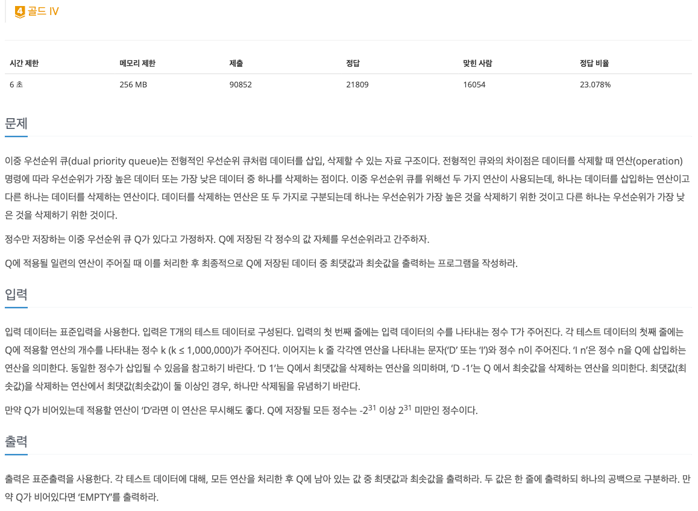
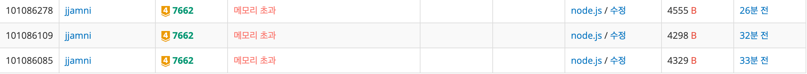

## 🔗 문제 링크

https://www.acmicpc.net/problem/7662

## 💬 문제


D 뒤의 값에 따라 최솟값을 pop하거나, 최댓값을 pop해야하는 문제이다.

## 🤔 접근

우선 힙을 써야한다는 것은 알겠는데, 우선순위가 두 개라서 어떻게 접근해야하나 고민했다.

1. MaxHeap을 만들고, 최솟값을 pop해야할 땐 subtree끼리 비교하기
   -> 구현 로직이 너무 어려워질 것 같았다.

2. MaxHeap, MinHeap을 모두 두고, 부호에 따라 해당 힙에서 pop하기 + visited 배열로 삭제된 값 관리
   -> 해당 방법이 좋을 것 같았다.

## ✏️ 해결

### 1. Heap 만들기

js로 우선순위 큐 문제를 풀 때의 가장 힘든 점 .. 내가 구현을 해야한다.(js를 선택한 죄)

이 또한 몇 번 만들다보니 이제 얼마 안걸리긴 한다.

<details>
<summary>너무 길어서 코드는 이 안에</summary>

```js
class MaxHeap {
  constructor() {
    this.heap = [];
  }

  push({ value, id }) {
    this.heap.push({ value, id });
    this.bubbleUp();
  }

  pop() {
    if (this.heap.length === 0) return null;
    if (this.heap.length === 1) return this.heap.pop();

    const max = this.heap[0];
    this.heap[0] = this.heap.pop();
    this.bubbleDown();

    return max;
  }

  top() {
    if (this.heap.length === 0) return null;
    return this.heap[0];
  }

  bubbleUp() {
    let idx = this.heap.length - 1;

    while (idx > 0) {
      let parent = Math.floor((idx - 1) / 2);

      if (this.heap[parent].value < this.heap[idx].value) {
        [this.heap[parent], this.heap[idx]] = [this.heap[idx], this.heap[parent]];
        idx = parent;
      } else break;
    }
  }

  bubbleDown() {
    let idx = 0;

    while (true) {
      let left = idx * 2 + 1;
      let right = idx * 2 + 2;

      if (left >= this.heap.length) break;

      let bigger = right < this.heap.length && this.heap[right].value > this.heap[left].value ? right : left;

      if (this.heap[idx].value < this.heap[bigger].value) {
        [this.heap[idx], this.heap[bigger]] = [this.heap[bigger], this.heap[idx]];
        idx = bigger;
      } else {
        break;
      }
    }
  }

  isEmpty() {
    return this.heap.length === 0;
  }
}

class MinHeap {
  constructor() {
    this.heap = [];
  }

  push({ value, id }) {
    this.heap.push({ value, id });
    this.bubbleUp();
  }

  pop() {
    if (this.heap.length === 0) return null;
    if (this.heap.length === 1) return this.heap.pop();

    const min = this.heap[0];
    this.heap[0] = this.heap.pop();
    this.bubbleDown();

    return min;
  }

  top() {
    if (this.heap.length === 0) return null;
    return this.heap[0];
  }

  bubbleUp() {
    let idx = this.heap.length - 1;

    while (idx > 0) {
      let parent = Math.floor((idx - 1) / 2);

      if (this.heap[parent].value > this.heap[idx].value) {
        [this.heap[parent], this.heap[idx]] = [this.heap[idx], this.heap[parent]];
        idx = parent;
      } else break;
    }
  }

  bubbleDown() {
    let idx = 0;

    while (true) {
      let left = idx * 2 + 1;
      let right = idx * 2 + 2;

      if (left >= this.heap.length) break;

      let smaller = right < this.heap.length && this.heap[right].value < this.heap[left].value ? right : left;

      if (this.heap[idx].value > this.heap[smaller].value) {
        [this.heap[idx], this.heap[smaller]] = [this.heap[smaller], this.heap[idx]];
        idx = smaller;
      } else {
        break;
      }
    }
  }

  isEmpty() {
    return this.heap.length === 0;
  }
}
```

</details>
<br>

~~문제 시작도 전에 200줄 가까이 되어버린 코드~~

### 2. visited 배열을 만들어 관리

MaxHeap에서 pop을 한 것은 MinHeap에서 알지 못한다.
나중에 MinHeap에서의 최솟값이 이미 MaxHeap에서 pop 하고 없어진 값일 수 있다.

따라서 원소에 id를 두고, 해당 id를 가진 원소가 이미 pop되었는지를 구분하는 visited 배열을 둔다.

pop 하기 전 해당 원소가 이미 pop되었는지를 판단하여 안되었다면 pop하고 배열에 체크한다.

```js
if (type === 'D') {
  if (value > 0) {
    // 최댓값 pop
    while (true) {
      let record = maxHeap.pop();
      if (!record) break;

      if (visited[record.id]) {
        visited[record.id] = false;
        break;
      }
    }
  } else {
    while (true) {
      // 최솟값 pop
      let record = minHeap.pop();
      if (!record) break;

      if (visited[record.id]) {
        visited[record.id] = false;
        break;
      }
    }
  }
}
```

### 3. 새로운 값 Push

새 값을 넣을 때는 MinHeap, MaxHeap 둘 다에 넣어준다. id값을 하나씩 키워주어 충돌되는 id가 없도록 한다.

```js
maxHeap.push({ value, id: currentId });
minHeap.push({ value, id: currentId });
visited.push(true);
currentId++;
```

## ⚠️ 문제

분명 로직은 다 잘 맞고, 반례도 다 풀리는데 메모리 초과 에러가 계속 났다.
 ㅠ.ㅠ

fs를 이용해 한 번에 입력을 받으니 입력에서 메모리가 터져버리는 것 같았다.

따라서 readline 방식으로 한 줄씩 입력을 받아 처리하는 형태로 입력을 변경했다.

### fs방식의 입력 처리

난 주로 이렇게 입력을 처리한다.

```js
const input = require('fs').readFileSync('/dev/stdin').toString().trim().split('\n');
```

이 방식은 stdin 전체를 메모리에 한 번에 올리고, 문자열로 만들고, 다시 쪼개서 배열로 만드는 것이다.

따라서 버퍼 + 문자열 + 배열. 이렇게 2~3배 정도의 메모리를 더 많이 쓴 것이다.

### readline은 어떻게 다를까?

readline은 입력을 스트림으로 한 줄씩 흘려보내면서 처리한다.

```js
const readline = require('readline');
const rl = readline.createInterface({ input: process.stdin });

rl.on('line', (line) => {
  // 들어오는 줄을 바로 처리
});
```

지금 처리 중인 line만 메모리에 들고, 처리 완료 후 내가 따로 저장하지 않는 이상 버려진다.

## 🤔 깨달은 점

문제를 푸는 자료구조, 알고리즘도 중요하지만, 입력이 큰 문제에서는 입력 처리가 메모리를 초과시킬 수 있다는 사실을 깨달았다.

## ✅ 전체 코드

```js
//이중 우선순위 큐 #7662
class MaxHeap {
  constructor() {
    this.heap = [];
  }

  push({ value, id }) {
    this.heap.push({ value, id });
    this.bubbleUp();
  }

  pop() {
    if (this.heap.length === 0) return null;
    if (this.heap.length === 1) return this.heap.pop();

    const max = this.heap[0];
    this.heap[0] = this.heap.pop();
    this.bubbleDown();

    return max;
  }

  top() {
    if (this.heap.length === 0) return null;
    return this.heap[0];
  }

  bubbleUp() {
    let idx = this.heap.length - 1;

    while (idx > 0) {
      let parent = Math.floor((idx - 1) / 2);

      if (this.heap[parent].value < this.heap[idx].value) {
        [this.heap[parent], this.heap[idx]] = [this.heap[idx], this.heap[parent]];
        idx = parent;
      } else break;
    }
  }

  bubbleDown() {
    let idx = 0;

    while (true) {
      let left = idx * 2 + 1;
      let right = idx * 2 + 2;

      if (left >= this.heap.length) break;

      let bigger = right < this.heap.length && this.heap[right].value > this.heap[left].value ? right : left;

      if (this.heap[idx].value < this.heap[bigger].value) {
        [this.heap[idx], this.heap[bigger]] = [this.heap[bigger], this.heap[idx]];
        idx = bigger;
      } else {
        break;
      }
    }
  }

  isEmpty() {
    return this.heap.length === 0;
  }
}

class MinHeap {
  constructor() {
    this.heap = [];
  }

  push({ value, id }) {
    this.heap.push({ value, id });
    this.bubbleUp();
  }

  pop() {
    if (this.heap.length === 0) return null;
    if (this.heap.length === 1) return this.heap.pop();

    const min = this.heap[0];
    this.heap[0] = this.heap.pop();
    this.bubbleDown();

    return min;
  }

  top() {
    if (this.heap.length === 0) return null;
    return this.heap[0];
  }

  bubbleUp() {
    let idx = this.heap.length - 1;

    while (idx > 0) {
      let parent = Math.floor((idx - 1) / 2);

      if (this.heap[parent].value > this.heap[idx].value) {
        [this.heap[parent], this.heap[idx]] = [this.heap[idx], this.heap[parent]];
        idx = parent;
      } else break;
    }
  }

  bubbleDown() {
    let idx = 0;

    while (true) {
      let left = idx * 2 + 1;
      let right = idx * 2 + 2;

      if (left >= this.heap.length) break;

      let smaller = right < this.heap.length && this.heap[right].value < this.heap[left].value ? right : left;

      if (this.heap[idx].value > this.heap[smaller].value) {
        [this.heap[idx], this.heap[smaller]] = [this.heap[smaller], this.heap[idx]];
        idx = smaller;
      } else {
        break;
      }
    }
  }

  isEmpty() {
    return this.heap.length === 0;
  }
}

const readline = require('readline');
const rl = readline.createInterface({ input: process.stdin });

let TC = null;
let currentTC = 0;
let calc = 0;
let opCount = 0;

let maxHeap = null;
let minHeap = null;
let visited = null;
let currentId = 0;
let answer = '';

rl.on('line', (line) => {
  if (TC === null) {
    TC = Number(line);
    return;
  }

  if (calc === 0) {
    calc = Number(line);
    maxHeap = new MaxHeap();
    minHeap = new MinHeap();
    visited = [];
    currentId = 0;
    opCount = 0;
    return;
  }

  let [type, value] = line.split(' ');
  value = Number(value);

  if (type === 'D') {
    if (value > 0) {
      while (true) {
        let record = maxHeap.pop();
        if (!record) break;

        if (visited[record.id]) {
          visited[record.id] = false;
          break;
        }
      }
    } else {
      while (true) {
        let record = minHeap.pop();
        if (!record) break;

        if (visited[record.id]) {
          visited[record.id] = false;
          break;
        }
      }
    }
  } else {
    maxHeap.push({ value, id: currentId });
    minHeap.push({ value, id: currentId });
    visited.push(true);
    currentId++;
  }

  opCount++;

  if (opCount === calc) {
    while (!maxHeap.isEmpty() && !visited[maxHeap.top().id]) {
      maxHeap.pop();
    }

    while (!minHeap.isEmpty() && !visited[minHeap.top().id]) {
      minHeap.pop();
    }

    if (maxHeap.isEmpty() || minHeap.isEmpty()) {
      answer += 'EMPTY' + '\n';
    } else {
      answer += `${maxHeap.top().value} ${minHeap.top().value}\n`;
    }

    currentTC++;
    calc = 0;

    if (currentTC === TC) {
      console.log(answer.trim());
      rl.close();
    }
  }
});
```

```toc

```
