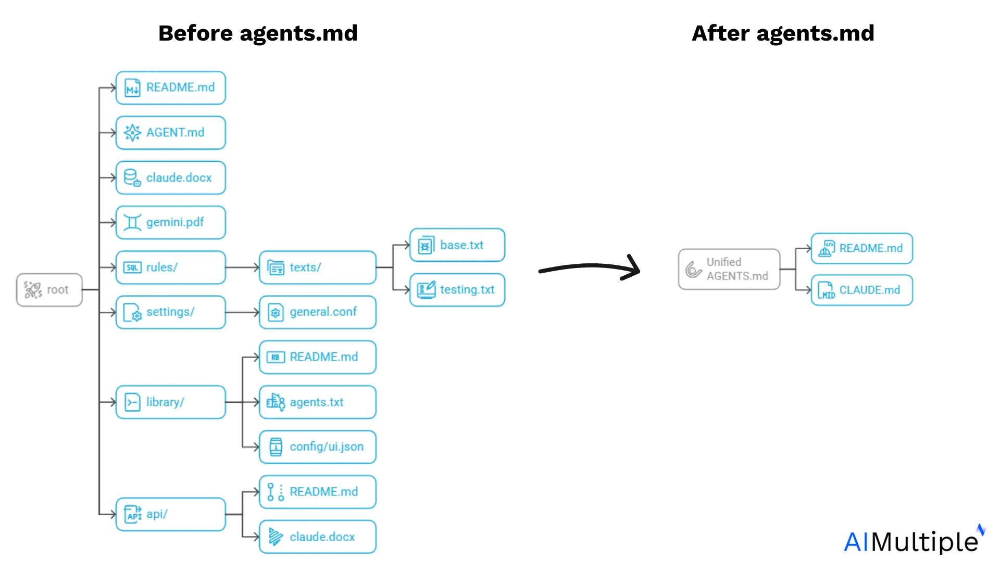
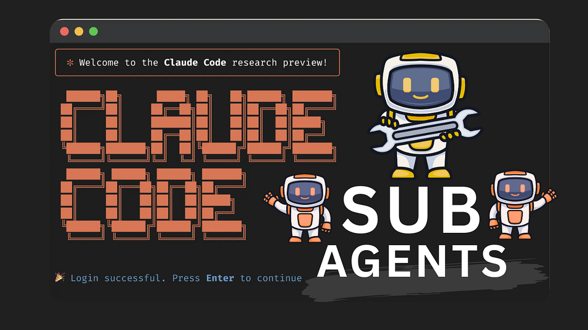
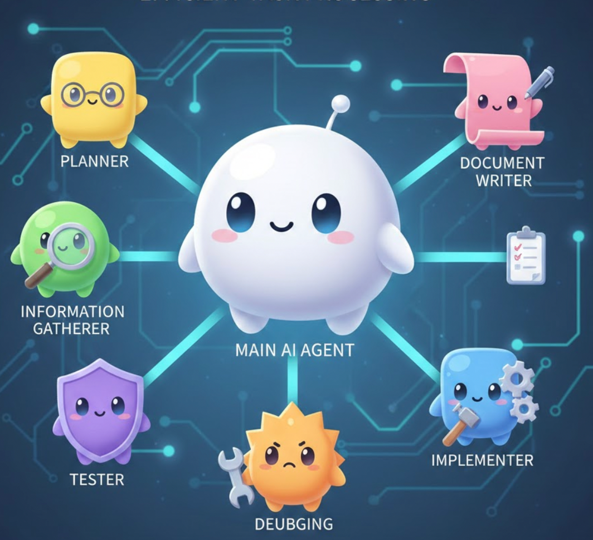
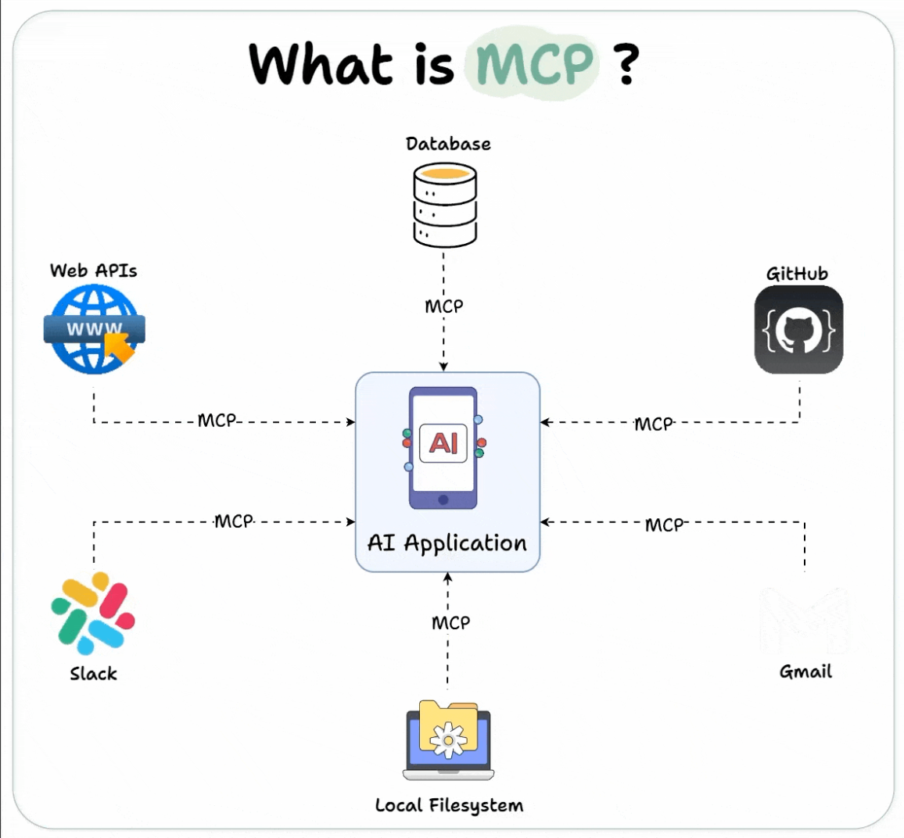

## AI agent란 무엇인가?

: AI를 사용해 사용자를 대신하여 목표를 추구하고 태스크를 완료하는 소프트웨어 시스템

- 단순한 명령어 실행을 넘어 상황 파악, 계획 수립, 정보 수집, 판단 및 수행까지 실행한다.

ex) 로그인 기능 만들어줘 ⇒ 폴더 구조 파악, 패키지 상태 파악 - 필요한 작업 쪼개기 - 코드 작성 - 테스트 - 정리

## AI Agent를 잘 쓰기 위한 방법

### 1. AGENTS.md 와 CLAUDE.md

AI agent는 프로젝트 전반에 대한 지식이 부족하다. 이를 파악하기 위해 많은 토큰 + 시간을 소모하여 프로젝트 내부 세팅과 코드를 읽거나, AI가 임의로 판단해서 실행하기도 한다. 임의로 판단하는 경우 원하는 결과물과 거리가 있기 때문에, 두 상황 모두 토큰만 낭비하고 원하는 결과값을 받지 못한다.



이를 위해 AI agent에게 미리 프로젝트에 대한 컨텍스트를 알려기 위해 나온 것이 AGENTS.md와 CLAUDE.md 같은 컨텍스트 파일이다.

AI agents가 작업하기 전에 해당 .md 파일만을 읽고 어떻게 작업해야하는지 등을 파악할 수 있게끔 한다.

이전에는 AI agent마다 컨텍스트 전달 방식이 달라서 각자 다른 AI Agent를 사용하는 사람끼리 협업시 설정 파일을 공유하기 힘들고, 통일시키기도 어려웠다.

| **도구**       | **규칙/지침 파일 위치**         |
| -------------- | ------------------------------- |
| Claude Code    | CLAUDE.md                       |
| Cursor         | .cursor/rules/                  |
| GitHub Copilot | .github/copilot-instructions.md |
| Windsurf       | .windsurfrules                  |

이후 agent만을 위한 표준을 만들자고 해서 등장한 것이 AGENTS.md이다. 아래 agent들이 AGENTS.md를 지원한다.

- GitHub Copilot
- Cursor AI
- Windsurf
- Google Jules
- Aider
- Cline
- Roo-Code
- Zed, Warp 등

근데 CLAUDE CODE는 지원 안하고 CLAUDE.md를 써야해서 사람들의 원성이 쌓이고 있다.


ㅠㅠ

### 2. Skills

AI를 이용해 코딩을 하다보면, 같은 작업을 반복해야하는 경우가 많다.

“폴더 구조는 다음과 같다.”, “해당 파일을 수정하면 특정 파일도 함께 수정해야한다.” 같은 계속해서 반복해야하는 것들을 AI agents에게 계속해서 얘기하기에는 귀찮고, 토큰을 많이 소비하기도 한다.

그렇다고 위에서의 AGENTS.md에 담아놓자니 AGENTS.md가 너무 길어지고, 필요없는 다른 내용들까지 모두 읽는데에 토큰이 소비된다.

이를 해결하기 위해 agent의 skill을 사용한다. AGENTS.md를 읽거나, /command 같이 입력하는 것이 아니다. 사용자의 요청에 따라 agent가 자율적으로 적절한 skill을 사용한다.

### 3. sub-agent



하나의 AI agents가 사용자의 요청을 한번에 정확하게 들어주기는 무리가 있다. 특히 크기가 큰 프로젝트 + 추상적인 질문이나 복잡한 요구사항의 경우 정보 수집, 계획 수립에만 토큰, 컨텍스트가 많이 소모되고 작업을 수행할 때에는 컨텍스트가 부족해 엉뚱한 일을 할 수 있다.



이를 효율적으로 해결하기 위해 여러 sub agent를 둔다. sub agent는 특정 작업에 특화되어 독립적으로 작동하는 인스턴스이다. 예를 들어 계획 전문가, 맥락 파악 전문가, 디버깅 전문가, 문서 작성 전문가, 구현 전문가 등 큰 작업을 위해 필요한 작은 업무들을 각각의 전문가를 만들어 해당 작업만 시키는 것이다.

sub agent의 장점

- **업무 분업화 및 전문성 확보**
- **병렬 작업 가능**
- **유연한 확장성**

### 4. MCP

MCP는 Model Context Protocol의 약자로, LLM이 다른 도구나 외부 데이터에 접근할 수 있도록 하는 규약이다.



AI agents는 단순 입력/응답만 하는 것이 아니다. github PR 작성, jira issue 가져오기, confluence 문서화, slack 자동 알림 등 여러 서비스와 함께 사용하면 더욱 편리하다. 이를 위해 나온 것이 MCP이다.

번외

## Cursor vs Claude Code

| **항목**             | **Cursor AI**                                                                             | **Claude Code**                                                          |
| -------------------- | ----------------------------------------------------------------------------------------- | ------------------------------------------------------------------------ |
| **핵심 역할**        | 잘 시키면 일 잘하는 부하                                                                  | 안 시켜도 알아서 일하는 알잘딱깔센 대리                                  |
| **주요 사용 환경**   | VS Code 기반의 통합 개발 환경                                                             | 터미널 및 IDE 통합                                                       |
| **강점**             | 실시간 코드 제안, 친숙한 인터페이스, 초보자 진입 용이성                                   | 복잡한 문제 해결, 다중 파일 작업, 프로젝트 전체 컨텍스트 이해            |
| **주요 사용자 후기** | “코딩 속도가 획기적으로 빨라졌다”, “페어 프로그래머 같다”                                 | “오류가 적고, 품질이 매우 높다”, “엄청나게 유능하다”                     |
| **이상적인 사용자**  | 일상적인 버그 수정이나 코드 작성 등 ‘작은 부분’의 생산성 향상을 원하는 개발자 및 비개발자 | 대규모 리팩토링이나 새로운 기능 구현 등 ‘큰 그림’ 작업을 선호하는 개발자 |

```toc

```
