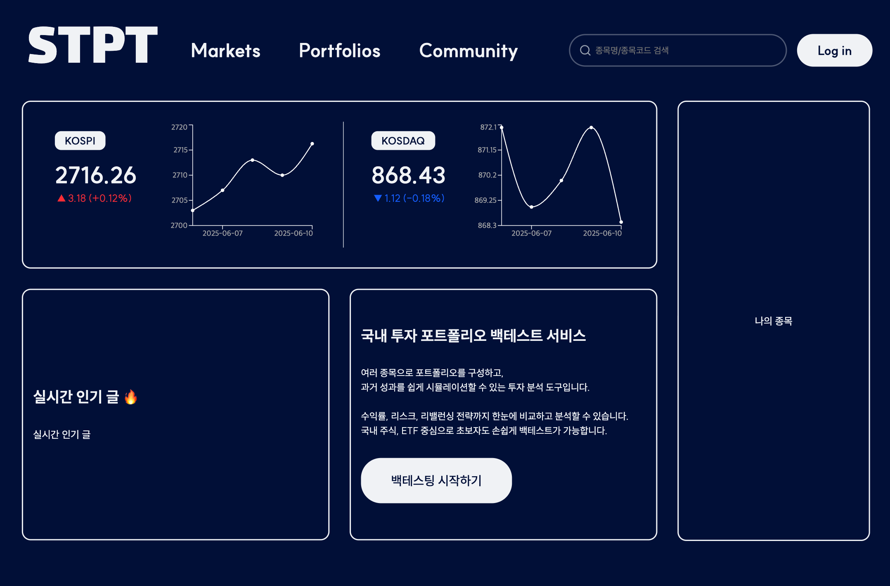
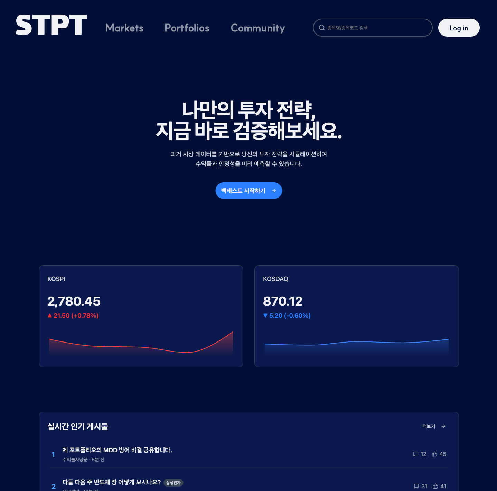

## 💡 메인페이지 디자인, 이대로 괜찮을까?

졸업 프로젝트로 주식 포트폴리오 백테스팅 웹 서비스를 개발 중이다.

초기 단계에서 메인페이지를 구성했지만, 실제로 적용해보니 여러 가지 문제점이 눈에 띄기 시작했다.

### 📸 기존 디자인

레이아웃을 통해 각 칸을 나누고 서비스의 기능을 보여주도록 구성했다. 그런데 ,, 


1. 백테스트 중심의 서비스임에도, 핵심 기능이 눈에 잘 띄지 않음  
2. 설명이 너무 길어, 사용자가 읽다가 흥미를 잃고 이탈할 가능성이 있음  
3. 디자인이 단조롭고, 동적인 느낌이 부족함  
4. 전체적인 구성의 우선순위가 명확하지 않아 사용자 흐름이 어색함  

그리고 무엇보다 ..

~~**너무 구려**~~

## 🛠️ 현재 디자인으로의 전환

문제들을 정리한 후, 가장 중요한 정보에 집중하고, 시각적으로 반응형 요소를 추가하기 위해 메인페이지 디자인을 전면 수정했다.

특히 “시장 지수 카드” 영역은 정보를 한눈에 파악할 수 있도록 구조를 단순화했고, 지수 변동을 색상과 간단한 애니메이션으로 시각화해 전달력을 높였다.

### 📸 새로운 디자인


처음 들어왔을 때 백테스트 기능을 강조하는 문구와 바로가기를 통해 사용자에게 서비스를 명확하게 전달한다.
그 아래에는 시장 지수를 시각화한 섹션을 배치하여, 현재 국내 주식 시장의 흐름을 한눈에 파악할 수 있도록 구성했다.  
전체적으로 이전보다 더 다채롭고 역동적인 인상을 준다.

## 📈 차트를 직접 그려보다 – Recharts 학습기
이번 작업을 하며 가장 흥미로웠던 것은 recharts 라이브러리를 사용해 직접 차트를 렌더링 한 것이었다. 이전 메인페이지에서도 사용하긴 했지만 단순 선만 그리는 정도라 데이터만 넣어주면 끝이었다.

하지만 구현하며 색상, 애니메이션, 방향성 등 신경을 많이 썼다.

### 🎨 상승/하락에 따라 선 색과 배경 색이 바뀌도록
```ts
const getChartColor = (direction: "up" | "down") => {
  switch (direction) {
    case "up":
      return "#EF4444"; // 빨간색
    case "down":
      return "#3B82F6"; // 파란색
    default:
      return "#9CA3AF"; // 중립색
  }
};
```
앞선 포스팅에서도 다뤘지만, 지수의 direction 값에 따라 선 색상과 그라데이션을 다르게 설정했다. 보통 주식에선 상승은 빨간색, 하락은 파란색으로 다루기에 해당 색을 사용하였다.
linearGradient를 활용해서 아래 영역으로 갈 수록 점점 투명해지게, 위는 진하게 처리해서 시각적인 강조를 더했다.

### 🧱 그라데이션 정의와 적용
```tsx
<defs>
  <linearGradient id={`color-${marketType}`} x1="0" y1="0" x2="0" y2="1">
    <stop offset="5%" stopColor={getChartColor(marketIndex.direction)} stopOpacity={0.4} />
    <stop offset="95%" stopColor={getChartColor(marketIndex.direction)} stopOpacity={0} />
  </linearGradient>
</defs>

<Area
  type="monotone"
  dataKey="value"
  stroke={getChartColor(marketIndex.direction)}
  strokeWidth={2}
  fillOpacity={1}
  fill={`url(#color-${marketType})`}
/>
```
그라데이션의 방향은 x1, y1, x2, y2 속성을 통해 위에서 아래로 흐르도록 설정했고, fill="url(#...)" 을 통해 상승/하락에 따른 색상을 차트 아래에 부드럽게 채워줬다.
### 📊 차트의 변동폭이 눈에 띄도록

기본 설정대로 렌더링하면 차트가 너무 완만해서 지수의 움직임이 잘 느껴지지 않았다.
그래서 Y축의 범위를 조정해, 변동이 더 극적으로 보이도록 처리했다.
```ts
<YAxis domain={["dataMin - 10", "dataMax + 10"]} hide />
```
이렇게 하니까 작은 수치 차이도 더 도드라져 보인다.

### ✅ 렌더링을 직접 컨트롤하며 느낀 점
처음 차트 라이브러리를 배우기 전에는 "그냥 데이터만 넣어주면 되는거 아니야?" 하고 간단하게 생각했다. 하지만 데이터를 어덯게 시각적으로 표현할 것인가, 사용자가 의미를 직관적으로 느끼게 할 수 있는가를 조금 더 고민해보게 되었다.

## 🎯 메인페이지 리디자인을 하며
사실 처음엔 디자인에 크게 관여할 생각이 없었다.
미적 감각이 부족하다고 생각했고, 주어진 디자인을 구현하는 것만 하면 된다고 여겼다.

하지만 이번 프로젝트를 통해 그런 생각이 완전히 바뀌었다. 프론트엔드는 디자인과 매우 밀접한 역할을 하며, 사용자 경험을 향상시키는 핵심 파트라는 것을 느꼈다.

팀원들과 함께 더 직관적이고 세련된 UI를 고민하다 보니 자연스럽게 디자인에 관여하게 되었고, 결과적으로 리디자인한 메인페이지를 보며 꽤 뿌듯한 감정이 들었다.(무엇보다 이쁨)

이제는 개발자로서 단순 기능 구현만 하는 것이 아니라, 사용자의 시선과 흐름까지 고려하는 사고방식을 더 키워야겠다고 느꼈다.

```toc

```