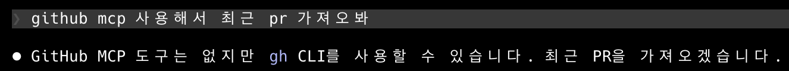

## 문제 상황

Claude Code에서 MCP(Model Context Protocol) 서버를 설정하려고 했다.

처음에 `.claude/` 디렉토리 안에 `.mcp.json`을 넣어봤는데, Claude Code가 MCP 서버를 인식하지 못했다.



```
project-root/
  .claude/
    .mcp.json   ← 여기에 넣으면 인식 안 됨
```

## 해결

프로젝트 루트 레벨에 `.mcp.json` 파일을 생성하니 정상적으로 MCP 서버가 연결됐다.

```
project-root/
  .mcp.json     ← 루트에 넣어야 동작함
```

설정 파일 내용은 다음과 같다.

```json
{
  "mcpServers": {
    "github": {
      "command": "npx",
      "args": ["-y", "@modelcontextprotocol/server-github"],
      "env": {
        "GITHUB_PERSONAL_ACCESS_TOKEN": "${GITHUB_PERSONAL_ACCESS_TOKEN}"
      }
    }
  }
}
```

## 주의사항

`.mcp.json`에 토큰을 직접 하드코딩하지 말고, `${ENV_VAR}` 형태로 환경변수를 참조하도록 하자. 그리고 `.gitignore`에 `.mcp.json`을 추가해서 저장소에 커밋되지 않도록 해야 한다.

```toc

```
