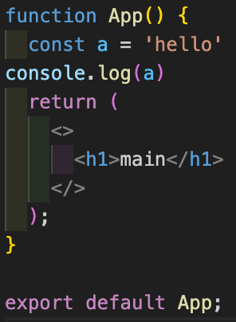

## 프로젝트 초기 세팅 (ESLint + Prettier)

졸업프로젝트 기획을 하고 본격적으로 구현에 들어가기 전, 프로젝트 세팅을 제대로 해두면 생산성이 올라갈 것 같아 여러 글들을 찾아보았다.

Vite를 이용해 기본 React + TypeScript 프로젝트는 생성하였고 코드 품질과 가독성을 위해 ESLint와 Prettier를 설정하려고 한다.

## ✏️ ESLint

ESLint는 코드를 정적 분석하여 문법 오류나 코드 규칙을 검사해주는 도구다.  
팀마다 일관된 코드를 유지할 수 있도록 도와준다.  
(예: 변수 선언하지 않았음, `==` 대신 `===` 써라 등)

## ✏️ Prettier

Prettier는 코드를 자동으로 포맷팅해주는 도구로, 들여쓰기, 세미콜론, 따옴표 같은 형식을 자동으로 정리해준다.  
코드 스타일을 일관적으로 맞춰주기 때문에 가독성을 높여준다.

> 쉽게 말하면 ESLint는 “이건 잘못된 코드야”  
> Prettier는 “형식 좀 예쁘게 정리할게” 라고 얘기해주는 도구다.

## 🔍 왜 ESLint + Prettier를 같이 설정해야 할까?

- ESLint는 문법 검사
- Prettier는 포맷 정리

각자 역할이 다르지만, 둘 다 코드 스타일에 영향을 미치기 때문에 함께 설정해주지 않으면 충돌이 생길 수 있다.

예) ESLint는 세미콜론을 강제하지만, Prettier는 사용하지 않도록 할 수도 있음 → 충돌 발생  
따라서 이 둘을 함께 설정해줘야 한다.


## 🔧 프로젝트에 ESLint + Prettier 설정하기

### ✅ 1. 필요한 패키지 설치

```bash
npm install -D eslint prettier \
  eslint-config-prettier eslint-plugin-prettier \
  @typescript-eslint/eslint-plugin @typescript-eslint/parser \
  eslint-plugin-react eslint-plugin-react-hooks
```

`eslint-config-prettier`, `eslint-plugin-prettier`는 충돌 방지를 위해 필요하다.


### ✅ 2. .eslintrc.js 설정 파일 만들기

```js
module.exports = {
  parser: '@typescript-eslint/parser',
  parserOptions: {
    ecmaVersion: 'latest',
    sourceType: 'module',
    ecmaFeatures: {
      jsx: true,
    },
  },
  extends: [
    'eslint:recommended',
    'plugin:react/recommended',
    'plugin:react-hooks/recommended',
    'plugin:@typescript-eslint/recommended',
    'plugin:prettier/recommended',
  ],
  plugins: ['react', '@typescript-eslint', 'prettier'],
  rules: {
    'prettier/prettier': 'warn',
    'react/react-in-jsx-scope': 'off',
    '@typescript-eslint/no-unused-vars': ['warn'],
  },
  settings: {
    react: {
      version: 'detect',
    },
  },
};
```


### ✅ 3. .prettierrc 설정 파일 만들기

```json
{
  "singleQuote": false,
  "semi": true,
  "tabWidth": 2,
  "trailingComma": "all"
}
```


### ✅ 4. .eslintignore / .prettierignore 만들기

```txt
node_modules
dist
build
```

>  `.eslintignore` 은 더 이상 지원하지 않기 때문에 `eslint.config.js`에 `ignores` 프로퍼티를 넣어서 적용할 수 있다.

```js
{
  ignores: ["dist", "node_modules", "build", "vite.config.ts"]
}
```


### ✅ 5. package.json에 스크립트 추가

```json
"scripts": {
  "lint": "eslint . --ext .ts,.tsx",
  "format": "prettier --write ."
}
```


### ✅ 6. 실행 명령어

```bash
npm run lint    # ESLint 실행
npm run format  # Prettier로 코드 자동 정리
```


## 🔥 VSCode 자동 실행 설정
해당 내용들만 적용했다고 VSCode에서 자동으로 설정해주진 않는다. .vscode 디렉토리를 만들고 세팅 파일을 넣어주자.

`.vscode/settings.json` 파일 생성

```json
{
  "editor.formatOnSave": true,
  "editor.defaultFormatter": "esbenp.prettier-vscode"
}
```


## 👍 결과
**적용 전**



**적용 후**


코드를 작성하고 저장하면 자동으로 예쁘게 포맷팅이 적용된다!
나의 상황에선 자동으로 세미콜론이 추가되고, 들여스기도 맞춰주고, 쌍따옴표로 바꿔줬다.

이전 팀 프로젝트에선 이런 설정을 하지 않았는데, 앞으로 팀/개인 프로젝트에선 꼭 적용하면 정말 편리할 것 같다.

```toc

```