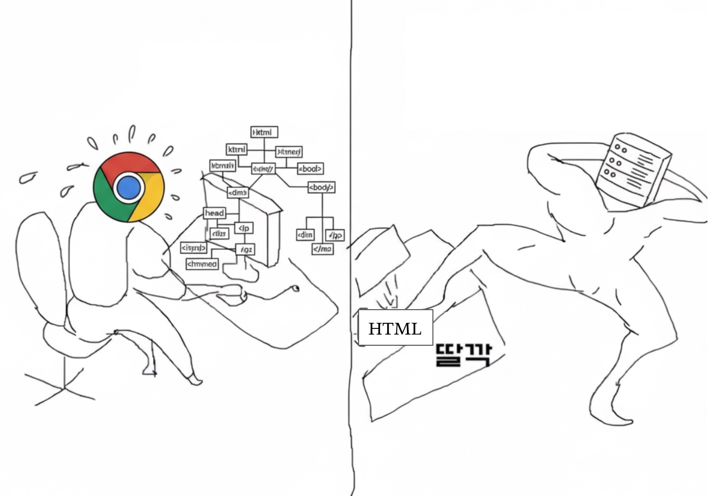

면접 단골 질문이자 웹에서 모든 행위의 시작점.

> ### "브라우저의 렌더링 동작 과정을 설명해주세요."

엄밀히 말하면 URL에 링크를 입력했을 때 모든 행위가 시작되긴 하지만,, (이것도 나중에 글을 쓰긴 할 것이다.)

정상적으로 서버로부터 HTML을 받았다고 가정하고 ! 브라우저의 렌더링 과정을 알아보자

## 1. DOM 트리 생성



서버로부터 HTML 파일을 받으면, 브라우저는 해당 HTML을 파싱하여 DOM 트리를 만든다.

> ### 💡 DOM이 뭐임?

> 😶 Document Object Model의 줄임말로, HTML 문서의 구조를 메모리에 트리 형태로 표현한 것! CSS나 JS를 적용할 때 브라우저가 이 트리의 각 노드에 접근한다.

## 2. CSSOM 트리 생성

DOM 트리를 열심히 만들다가 style 태그나 link 태그를 만나면, 브라우저는 서버에 CSS 파일을 요청한다.
CSS파일을 받으면 해당 파일을 DOM처럼 트리 형태로 파싱하는데, 이를 CSSOM 트리라고 한다!

(씨에쓰에쓰오엠, 씨에쓰에쓰옴,, 뭐라고 읽어야할 지 모르겠지만, CSS Object Model 이라고 읽는게 제일 정확할 듯)

## 3. 렌더 트리 생성

만들어진 DOM과 CSSOM을 합쳐서 렌더 트리를 만든다. 이 때는 실제 화면에 보이는 노드만 포함한다.

## 4. 레이아웃 계산

렌더 트리의 각 요소에 대해 위치와 크기(마진, 패딩 높이 등)를 계산한다.

화면에서 요소가 어디에 배치되고 얼마나 공간을 차지할지 정하는 단계!

## 5. 페인팅

레이아웃이 잡힌 요소들에 대해 스타일을 그린다. 색상, 투명도, 그림자 등이 포함된다!

## 6. 합성

화면에는 여러 요소가 겹쳐 있을 수 있는데, 어떤 요소가 위에 보일지 결정한다. 페인팅된 여러 레이어를 합쳐 최종 화면에 보여준다.

## 추가 궁금점

> ### 💡 리플로우와 리페인트의 차이가 뭐에요?

### Reflow

: 요소의 위치나 크기를 다시 계산하는 과정

: 구조나 스타일이 변해서 레이아웃 자체가 바뀌는 것.

성능 비용 크다 → 전체 문서의 레이아웃을 다시 계산할 수 있음

### Repaint

: 레이아웃은 그대로 두고 스타일만 다시 그리는 과정

: 그림자, 색상, visiblity가 변경될 때 발생

Reflow보다는 가볍지만 GPU/CPU 연산이 필요하다.

> ### 💡 Reflow가 왜 성능 비용이 크지 ??

DOM 구조나 스타일이 변경되면, 렌더 트리의 레이아웃을 다시 계산해야 한다!

Repaint는 단순히 픽셀만 다시 칠하면 되지만, Reflow는 레이아웃 전체를 다시 계산하기 때문에 더 비용이 크다.

> ### 💡 DOM에 접근하는게 왜 무거워 ??

JS 엔진과 브라우저 렌더링 엔진은 별개로 동작한다!

- 렌더링 엔진(브라우저 엔진, 보통 C++로 구현됨)

- JS 엔진(V8, SpiderMonkey, JavaScriptCore)

JS에서 DOM API를 호출하면 JS 엔진 <-> 브라우저 엔진을 오가면서 작업해야하는데, 이 과정이 비용이 크다!!

> ### 💡 그래도 화면 갱신하려면 DOM에 접근해야하는데 어떡해?

그렇다. 결국 화면을 업데이트하려면 DOM에 접근해야하는데,,

이 접근을 효율적으로 하기 위해 나타난 개념이 가상 DOM이다 !

다음 글에서는 가상 DOM이 무엇이고 어떻게 동작하는지, React가 이 가상 DOM을 어떻게 활용하는지 써볼 예정이다.

```toc

```
