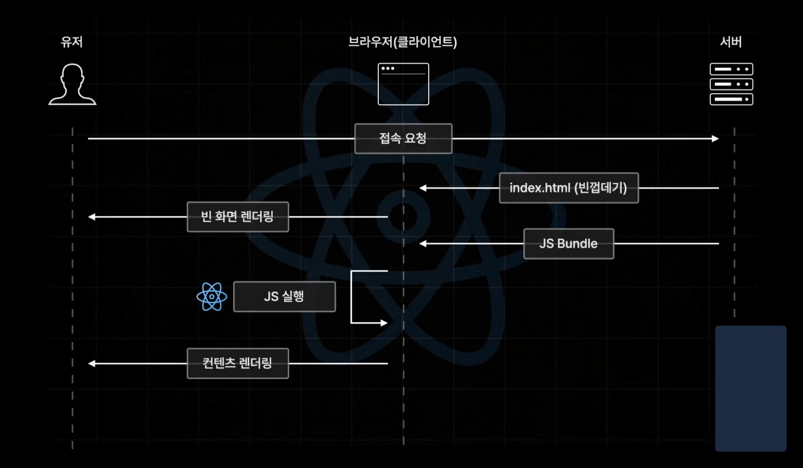
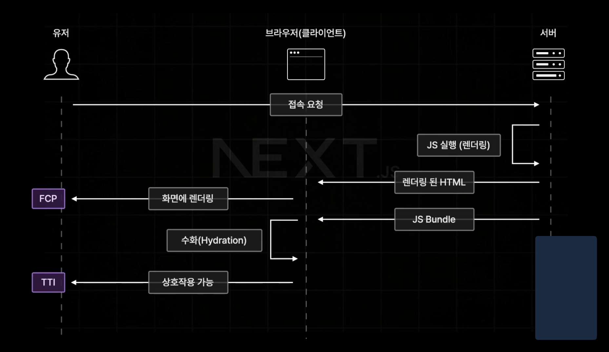
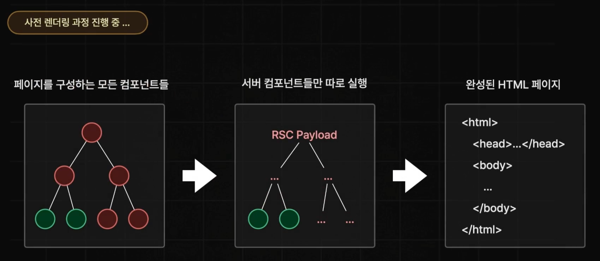

## 기존 리액트 컴포넌트와 서버 사이드 렌더링의 한계

- 리액트의 컴포넌트 렌더링 과정



- 서버 사이드 렌더링 과정



### 서버 사이드 렌더링의 한계

1. 자바스크립트 번들 크기가 0인 컴포넌트를 만들 수 없다.

   사용자가 작성한 HTML을 화면에 그리기 전에, 위험한 태그를 제거하기 위해 sanitizeHTML 이라는 라이브러리를 많이 사용한다. 이 라이브러리의 번들 용량은 고스란히 사용자 기기에게 부담이 된다.

2. 백엔드 리소스에 직접적인 접근이 불가능하다.

   사용자 브라우저에서 직접 DB에 접근하게 하기 위해선 사용자에게 key를 알려주어야함. 그래서 사실상 불가능에 가깝다. (백엔드의 REST API 이용)

3. 자동 코드 분할이 불가능하다.

   기존 클라이언트 컴포넌트의 경우, lazy loading 등을 위해 개발자가 직접 lazy 설정을 해주고, 분기를 타기 전까지 어떤 컴포넌트를 불러올 지 알 수 없음

4. 연쇄적으로 발생하는 클라이언트와 서버의 요청을 대응하기 어렵다.

   한 컴포넌트 렌더링의 결과로 다른 컴포넌트를 렌더링하는 경우: 이전 렌더링이 끝나기 전까지 이후 렌더링이 시작도 안됨. 서버 요청 횟수도 많아진다.

서버 사이드 렌더링: 정적 콘텐츠를 빠르게 제공, 서버 데이터에 쉽게 접근 가능. 하지만 인터랙션에 따른 사용자 경험 다양화가 어렵다.

클라이언트 사이드 렌더링: 인터랙션에 따라 다양한 것을 제공할 수 있지만, 느리고 데이터를 가져오기 어렵다.

## 서버 컴포넌트란?

: 하나의 언어, 프레임워크, API와 개념을 사용하면서 서버와 클라이언트 모두에서 컴포넌트를 렌더링할 수 있는 기법

서버에서 처리 가능한 일 → 서버가 처리

나머지 일 → 클라이언트(=== 브라우저)에서 수행

클라이언트 컴포넌트는 서버 컴포넌트를 import 할 수 없다. - 클라이언트 컴포넌트가 서버 컴포넌트를 실행할 방법이 없기 때문(서버 환경이 브라우저에는 없어서)

### 서버 컴포넌트

- 요청이 오면 서버에서 딱 한 번 실행된다. 따라서 상태를 가질 수 없음. useState, useReducer 사용 불가능
- 렌더링 생명주기를 사용할 수 없다. 한 번 렌더링하면 그걸로 끝이기 때문. useEffect 사용 불가능
- 위의 제약으로 인해 커스텀 훅도 사용할 수 없다. (서버에서 제공하는 기능만 사용하는 훅은 가능)
- 브라우저에서 실행되지 않기 때문에 DOM API를 쓰거나 window, document 객체에 접근할 수 없다.
- DB, 파일 시스템 등 서버에 있는 데이터를 async/await로 접근 가능. 컴포넌트 차제가 async하다.

### 클라이언트 컴포넌트

- 브라우저 환경에서 실행되므로 서버 컴포넌트를 불러오거나, 서버 전용 유틸리티를 불러올 수 없다.
- 서버 컴포넌트가 클라이언트 컴포넌트를 렌더링하는데, 클라이언트 컴포넌트가 자식으로 서버 컴포넌트를 갖는 구조는 가능하다. 이미 클라이언트 컴포넌트 입장에서는 서버 컴포넌트가 만들어져 보여주기 때문.
- 일반 우리가 아는 리액트 컴포넌트와 같다. state, effect를 사용 가능하며 브라우저 API 에도 접근 가능

### 공용 컴포너트

- 서버와 클라이언트 모두에서 사용할 수 있다. 둘 모두의 제약을 받는다.

리액트는 모든 컴포넌트를 공용 컴포넌트로 판단 → 클라이언트 컴포넌트를 명시적으로 선언할 수는 있다.

`“use client”`

## 서버 사이드 렌더링과 서버 컴포넌트의 차이

### 서버 사이드 렌더링

: 응답받은 페이지를 HTML로 렌더링하는 과정 → 서버에서 수행

: 클라이언트에서 하이드레이션 과정을 통해 이벤트를 붙이거나 작업 수행한다.

따라서 인터랙션이 불가능. 정적인 HTML을 빠르게 내려주는 데 초점을 둔다.

### 서버 컴포넌트

: 서버에서 모든 컴포넌트 렌더링을 마친 후 결과물만 내려줌

: 모든 과정이 끝난 후에 컴포넌트를 볼 수 있다. (데이터 패칭 등)

둘은 상호 보완적인 개념이다.

## 서버 컴포넌트는 어떻게 동작하는가?



1. 서버가 렌더링 요청을 받으면 루트 컴포넌트부터 실행이 시작된다.
2. 서버 컴포넌트만 실행되고, 실행된 컴포넌트는 html이 아닌 json 같은 데이터 형태로 변함(가볍다!)
3. 클라이언트 컴포넌트도 실행되고, HTML이 완성된다.
4. 브라우저에서 이 HTML을 받는다. 여기서 RSC Payload를 파싱해서 트리로 재구성한다.

## 결론

리액트 서버 컴포넌트는 새로운 개념이며, 기존 리액트 컴포넌트가 가지고 있던 한계를 극복하기 위해 만들어졌다.

```toc

```
