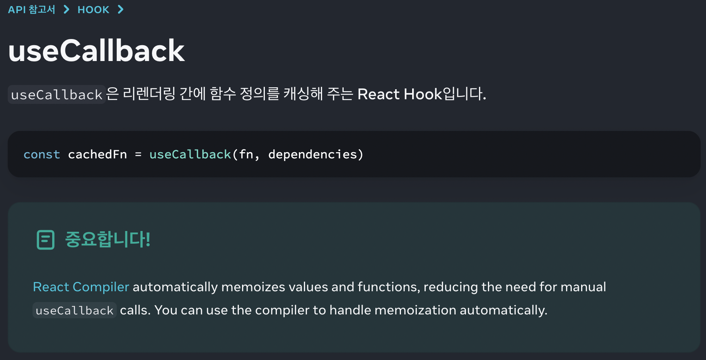
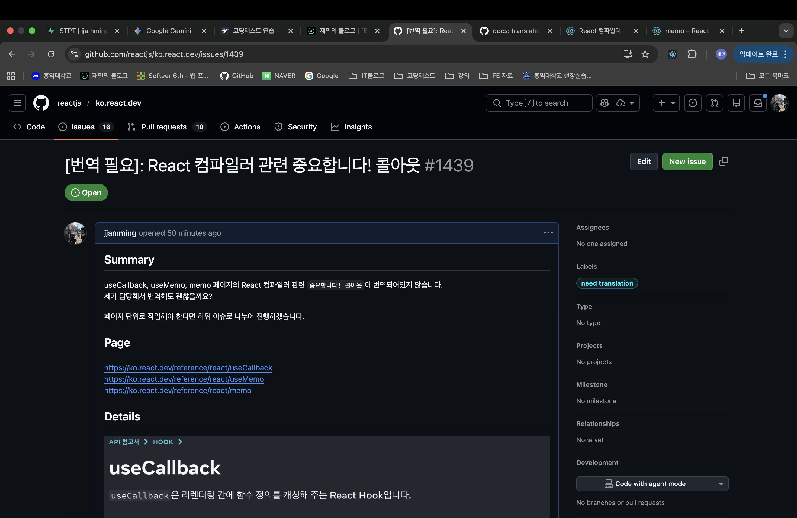
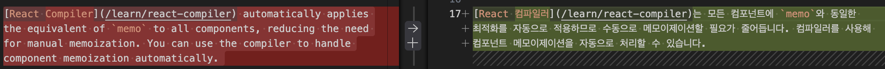

## ko.react에 번역 기여하기

얼마 전 React 공식 문서에 첫 기여를 했다!
React 컴파일러 관련 문서에 새로 추가된 Note callout 3개(useCallback, useMemo, memo)를 번역했고, PR이 머지됐다.

큰 기능 추가도 아니고, 분량도 짧은 번역 작업이었다.
그래도 개인적으로는 꽤 의미 있는 경험이어서, 가볍게 기록을 남겨보고자 한다.

## 계기

처음에는 useCallback 문서를 읽다가 React 컴파일러 관련 Note를 발견했다.
React 컴파일러가 등장하면서 “수동 메모이제이션의 필요가 줄어든다”는 메시지를 강조하는 문장이었는데, 비교적 최근 추가된 부분이다보니 아직 번역이 안되어있었다.



간단한 두 문장이었지만 직접 번역해서 기여해보고 싶었고, 자연스럽게 비슷한 최적화 맥락을 가진 useMemo와 memo 페이지도 떠올랐다.
같은 개념을 설명하는 문장들이므로 일관성있게 번역하면 좋겠다는 생각이 들었고, useCallback뿐만 아니라 useMemo, memo 페이지의 Note까지 함께 번역하게 됐다.

페이지의 스크린샷과 함께 issue를 작성했다.

https://github.com/reactjs/ko.react.dev/issues/1439



3일 정도 뒤 담당자로 할당받았고, 문장 번역을 시작했다.

## 고민했던 점

짧은 문장이었지만, 생각보다 고민이 많았다.

정확한 정보를 전달하기 위한 문서이다보니 원문의 내용이 오해 없이 전달되게끔 번역하는 것이 중요했다.

이를 위해 통일한 어휘들도 있고, 아래 사진과 같은 best practice 컨벤션들도 있었다.


모범 사례들을 보며 어떻게 번역해야 쉽고 빠르게, 그리고 정확하게 정보를 전달할 수 있을지 고민했다.

```plain
React Compiler automatically memoizes values and functions, reducing the need for manual `useCallback` calls.
```

위 문장의 경우 React 컴파일러가 어느정도 자동으로 메모이제이션을 처리해주기 때문에, useCallback을 이전만큼 일일이 사용하지 않아도 된다는 뉘앙스다. 아래 두 문장중 고민했다.

```
1. React 컴파일러는 값과 함수를 자동으로 메모이제이션하므로 `useCallback`을 수동으로 사용할 일이 줄어듭니다.

2. React 컴파일러는 값과 함수를 자동으로 메모이제이션하므로 `useCallback`을 수동으로 사용할 일을 줄여줍니다.
```

사실 둘 다 의미는 통하겠지만... 더 자연스럽게 전달됐으면 하는 마음에 고민했다.

2의 React 컴파일러가 일을 줄여주는 것은 맞지만, 원문에서 쉼표에 의한 호흡 조절과 결국 독자가 사용할 일이 줄어든다는게 더욱 전달이 잘 될 것 같아서 1으로 결정했다.

또 하나는 “equivalent of memo” 의 번역이었다.
memo와 동일한 작업을 수행한다는 맥락인데, 냅다 “memo랑 동일한 것” 이라고 번역하기엔 어색할 것 같아 “memo와 동일한 최적화” 라고 번역했다.

## PR 작성 후 승인

[PR] [docs: update keeping-components-pure.md](https://github.com/reactjs/ko.react.dev/pull/1440)

번역 완료 후 PR을 작성했다! 아래 3개 커밋이 나의 첫 오픈소스 기여 코드다.

- useCallback.md
  

- useMemo.md
  

- memo.md
  

문제 없이 승인받았다! 큰 오역 없이 잘 번역했다는 의미로 받아들여져 뿌듯했다.


## 느낀점

처음에는 ‘단순 번역 작업이겠지’라고 생각했다. 요즘은 AI가 번역도 앞뒤 맥락에 맞춰 잘 해주기 때문에, 별 고민이 없을 줄 알았다.

하지만 실제로 기여를 진행하면서 원작자가 전달하고자 했던 정보가 무엇인지 정확히 이해하고, 번역에 따라 내가 독자라면 어떻게 받아들일지를 고민하는 과정이 필요했다.

같은 단어가 다른 페이지에선 어떻게 번역되었는지, 조사는 어떤걸 썼는지 등을 철저하게 알아보고 번역했다. 부끄럽지만, 3문장을 고민하고 번역하는데 2시간이 걸렸다 😂

이 과정을 통해 문서 번역은 단순히 문장을 옮기는 작업이 아니라, 독자가 잘 이해할 수 있도록 정보를 전달하는 과정의 일부라는 것을 깨달았다.

이런 디테일을 위해 보이지 않는 곳에서 꾸준히 고민하는 사람들이 이미 있었고,
그 흐름에 아주 작은 부분이라도 기여했다는 점이 개인적으로는 꽤 뿌듯하게 남았다.

다음에는 조금 더 큰 단위의 번역이나 개선에도 도전해보고 싶다.

### 번역이 포함되어 있는 페이지 (와!)

- [useCallback](https://ko.react.dev/reference/react/useCallback)

- [useMemo](https://ko.react.dev/reference/react/useMemo)

- [memo](https://ko.react.dev/reference/react/memo)

p.s 번역 표현이나 용어에 대한 의견이 있으시다면 언제든 환영합니다 🤗
