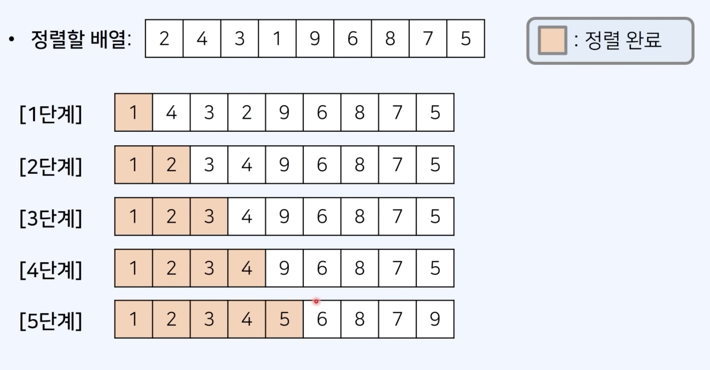
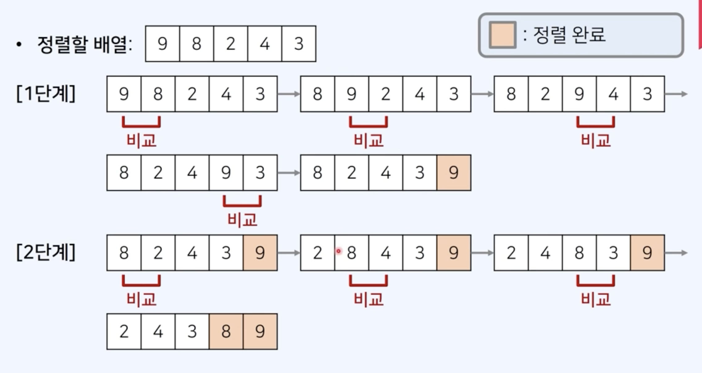
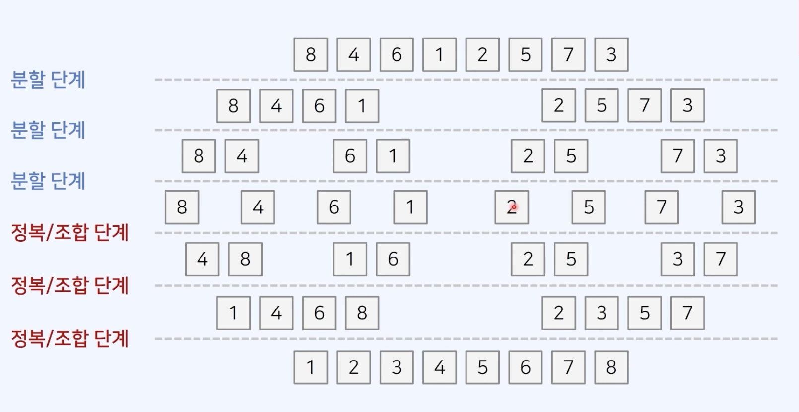

코딩 테스트 준비를 위해 알고리즘을 기초부터 탄탄하게 공부하는 중이다.

제일 기초가 되는 정렬 알고리즘 중 선택, 버블, 삽입, 합병 정렬을 정리해보고자 한다. (with JavaScript)

## 선택 정렬(Selection Sort)

선택 정렬은 매 단계에서 가장 작은 원소를 선택하여 앞으로 보내는 정렬 방법으로, 한 번 제일 앞으로 보내진 원소는 더 이상 옮겨지지 않는다.

시간복잡도는 O(n^2)로 효율적이라고 볼 수는 없지만, 구현이 쉽기 때문에 라이브러리를 사용하지 못하는 상황 + 입력이 크지 않은 상황 이라면 빠르게 구현해서 사용하기 쉽다.

순서는 다음과 같다.

1. 각 단계에서 원소를 순회하며 가장 작은 원소를 찾는다.
2. 현재까지 처리되지 않은 원소(정렬된 원소 다음) 중 가장 앞의 원소와 자리를 교체한다.
3. 모든 원소에 대해 반복한다.

아래 사진으로 이해해보자

1단계 : 배열을 모두 순회해서 가장 작은 원소 1을 제일 앞으로 보낸다.<br/>
2단계 : 1까지는 정렬이 완료되었으니 4(arr[1])부터 5까지 원소를 순회하여 가장 작은 원소인 2를, 정렬 완료된 1 뒤 위치로 옮긴다<br/>
... 모든 원소에 대해 반복을 수행한다.

코드로 직접 구현해보자

**코드 예시**

```js
//selectionSort
const selectionSort = (arr) => {
  for (let i = 0; i < arr.length; i++) {
    let minIndex = i;
    for (let j = i + 1; j < arr.length; j++) {
      // 가장 작은 원소의 위치 찾기
      if (arr[minIndex] > arr[j]) {
        minIndex = j;
      }
    }
    // 가장 작은 원소를 현재까지 정렬된 원소 다음 위치로 변경
    let temp = arr[i];
    arr[i] = arr[minIndex];
    arr[minIndex] = temp;
  }
};
```

모든 원소에 대해 순회해야해서 O(n)의 시간복잡도가 걸리고(i-loop), 해당 원소에 대해 가장 작은 원소를 찾기 위해 O(n)의 시간복잡도가 추가로 걸려(j-loop) O(n^2)의 시간복잡도가 걸리는 것이다.

## 버블 정렬(Bubble Sort)

버블 정렬은 인접한 두 원소를 비교하여 작은 원소를 앞쪽으로 오게끔 위치를 변경하는 정렬 방법이다. 원소가 계속 밀려나며 정렬되는 것이 거품이 물에 뜨는 것과 비슷하여 붙여진 이름이다.

선택 정렬과 마찬가지로 시간복잡도가 O(n^2)이라 비효율적이다.

순서는 다음과 같다.

1. 각 단계에서 인접한 두 개의 원소를 비교하여, 필요시 위치를 변경한다.
2. 한 단계가 수행되면(배열의 순회가 끝나면) 가장 큰 원소가 맨 뒤로 이동하게 된다.
3. 맨 뒤 원소의 위치는 정해진 것이므로, 해당 원소를 제외하고 배열에 대해 다시 1의 과정을 반복한다.


맨 앞부터 두 개의 원소를 비교하여 큰 원소가 거품처럼 뒤로 밀리는 형식이다. 각 단계가 끝나면 가장 큰 원소가 맨 뒤에 위치하게 된다.

아래는 코드이다.

```JS
//bubbleSort
const bubblesort = (arr) => {
  for(let i = arr.length - 1; i>0; i--){
    for(let j = 0; j < i; j++){
      if(arr[j] > arr[j+1]){
        let temp = arr[j];
        arr[j] = arr[j+1];
        arr[j+1] = temp;
      }
    }
  }
}
```

구현이 매우 간단하다. i는 배열에서 정렬되지 않은 마지막 인덱스를 의미하며, 각 단계가 지날 수록 맨 뒤(i+1번 째)에는 가장 큰 원소가 오게되고 정렬이 완료된 상태기 때문에 더 이상 비교할 필요가 없다.

예를 들어 [5, 3, 4, 1, 2] 를 오름차순으로 정렬한다고 해보면,

    •	1회전 끝 → 가장 큰 5가 맨 끝으로 이동 → [3, 4, 1, 2, 5]
    •	2회전 끝 → 두 번째로 큰 4가 그 앞에 위치 → [3, 1, 2, 4, 5]

이런식으로 각 단계가 지날 때마다 가장 큰 원소가 맨 뒤에 오게 되고, 모든 원소에 대해 순회하면 오름차순으로 정렬이 된다.

반대로 내림차순으로 정렬하고 싶다면 `if(arr[j] < arr[j+1])`로만 바꿔주면 된다.

## 삽입 정렬(Insertion Sort)

삽입 정렬은 각 단계에서 비교하는 원소의 좌측 배열은 모두 정렬이 되어있다고 가정하고, 해당 원소가 정렬된 배열의 어디에 위치할지를 찾아 그곳에 삽입하는 알고리즘이다.

지금까지 정리한 선택 정렬이나 버블 정렬처럼 시간복잡도는 O(n^2)이지만, 이미 거의 정렬되어 있는 배열에 대해서는 매우 빠르게 작동하는 특징이 있다.

예를 들어, [5, 3, 4, 1, 2]의 배열이 있을 때

    1.	처음 원소 5는 혼자니까 이미 정렬된 상태로 간주
    2.	다음 원소 3 → 5보다 작으니까 5 앞에 삽입 → [3, 5, 4, 1, 2]
    3.	4는 5보단 작고 3보단 크니까 3과 5 사이에 삽입 → [3, 4, 5, 1, 2]
    4.	1은 제일 작으니까 맨 앞으로 → [1, 3, 4, 5, 2]
    5.	마지막 2는 3보다 작고 1보다 크니까 중간에 삽입 → [1, 2, 3, 4, 5]

이런 식으로 현재 원소 기준으로 좌측 정렬된 배열에서 현재 원소가 들어갈 위치를 찾아 넣어주는 방식이다. 아래는 코드이다.

```JS
//Insertion Sort
const insertionSort = (arr) => {
  for(let i = 1; i < arr.length; i++){
    for(let j = i; j > 0; j--){
      // 현재 위치에서부터 좌측 정렬된 배열을 순회
      if(arr[j] < arr[j-1]){
        // 현재 원소가 좌측 원소보다 작다면, 한칸씩 자리를 옮긴다.
        let temp = arr[j-1];
        arr[j-1] = arr[j];
        arr[j] = temp;
      } else{
        // 현재 원소가 좌측 원소보다 크다면, 지금 위치가 들어갈 자리
        break;
      }
    }
  }
}
```

현재 원소의 위치 i 를 기준으로 좌측(정렬된 배열)의 원소를 하나하나 현재 원소와 비교하여 정렬된 위치를 찾고, 그 자리에 들어가는 방식이다.

## 합병 정렬(Merge Sort)

합병 정렬은 위에서 알아본 정렬 방법과 달리 O(n log n)의 시간복잡도를 가진다. 이는 매우 빠르기 때문에 실제로 많은 양의 데이터를 정렬할 때 합병 정렬을 많이 사용한다.

합병 정렬은 컴퓨터 공학에서 많이 사용되는 분할 정복(Divide & Conquer) 방식을 통해 이루어지는데 자세한 과정은 다음과 같다.

1. 분할(divide) : 정렬할 배열(큰 문제)을 같은 크기의 두 부분 배열(작은 문제)로 나눈다.
2. 정복(conquer) : 부분 배열(작은 문제)을 정렬한다.
3. 조합(combine) : 정렬된 부분 배열을 하나의 배열로 다시 병합한다.

해당 순서로 합병 정렬이 이루어지며, 주로 분할 정복 방식은 재귀함수를 통해 구현되는데 이는 작은 문제로 분할하는 것은 같은 방법을 통해 이루어지기 때문이다. 하지만 같은 함수를 계속 호출하기 때문에 오버헤드가 발생할 수 있다는 단점이 있다.


각 분할 단계에서는 배열을 같은 크기의 부분 배열 2개로 쪼개고, 더 쪼갤 수 없을 때 정복/조합 단계를 실행한다. 조합이 완료된 배열은 정렬된 배열이고, 이를 다른 정렬된 부분 배열과 정복/조합하여 하나의 큰 배열이 정렬 완료된다.

다음은 코드이다. 코드는 병합을 수행하는 merge 함수와 큰 정렬을 수행하는 mergeSort 함수로 구성된다.

```js
/// merge 함수
const merge = (left, right) => {
  const sorted = [];
  let i = 0;
  let j = 0;

  while (i < left.length && j < right.length) {
    if (left[i] < right[j]) {
      sorted.push(left[i]);
      i++;
    } else {
      sorted.push(right[j]);
      j++;
    }
  }
  return [...sorted, ...left.slice(i), ...right.slice(j)];
};

const mergeSort = (arr) => {
  if (arr.length <= 1) {
    return arr;
  }
  const mid = parseInt(arr.length / 2);
  const left = mergeSort(arr.slice(0, mid));
  const right = mergeSort(arr.slice(mid));

  return merge(left, right);
};
```

### 헷갈렸던 부분

재귀함수라는게 이해가 되는 듯 하다가도 코드를 하나하나 따라가보면 이게 맞나 싶고 어떤 식으로 흘러가는지 몰랐다. 특히 mergeSort의 left, right 부분이 이해가 안돼서 콘솔을 찍어보며 어떤 식으로 흐름이 흘러가는지 이해하려고 노력했다.

1. 처음 arr가 들어감
2. left에서 arr를 반으로 쪼갠 부분 배열에 대해 mergeSort 함수를 다시 실행
3. 계속 반으로 쪼갬 (정렬은 아직 하지 않는다.) 배열의 길이가 1이 될 때까지 수행된다.
4. 배열의 길이가 1이 되면(정렬이 완료 되면) left에 해당 배열이 반환된다. right 배열도 마찬가지. 이제 merge에 해당 배열들이(초기엔 원소 한 개) 들어가서 정렬이 이루어지게 된다.

## JavaScript에서 제공하는 정렬 함수

자바스크립트에서는 sort 라는 정렬 함수를 제공해주는데, 이는 O(n log n)의 시간복잡도를 보장해주기 때문에 코딩테스트에서 sort 함수 사용이 가능하다면 해당 함수를 사용하는 것이 쉽고 편리할 수 있다. 하지만 사용이 제한되는 경우, 바로 위에서 본 mergeSort를 직접 구현하여 사용해야 할 것 같다.

### sort() 함수

sort() 함수는 문자열을 정렬할 때에는 그냥 사용할 수 있지만, 숫자를 정렬하기 위해서는 내부에 비교 함수를 넣어주어야 한다.

비교 함수 원리

- a - b가 음수 → a가 b보다 앞에
- a - b가 양수 → b가 a보다 앞에
- 0 → 순서 유지
  따라서 오름차순 정렬을 위해서는 `sort((a,b) => a - b);` 형식으로 호출해서 사용하면 된다.

```toc

```
