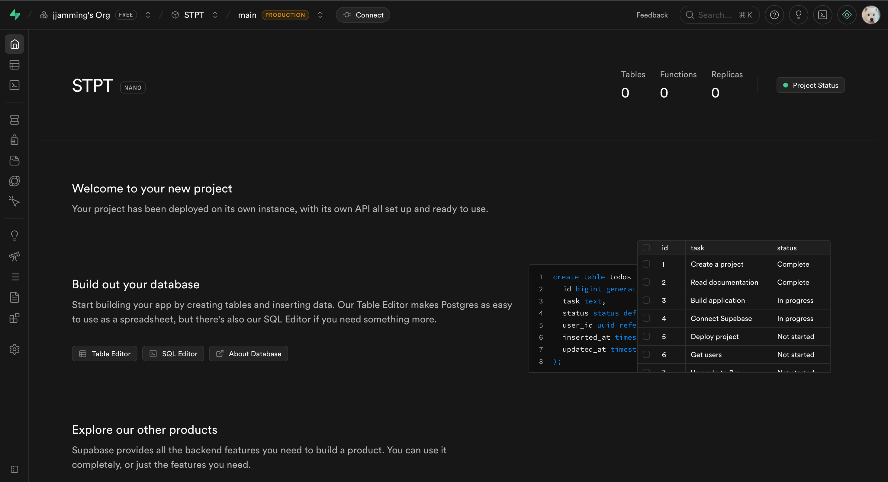
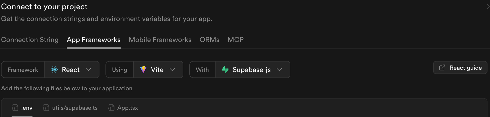

## 1️⃣ Supabase 프로젝트 생성하기

일단 supabase에 새로운 프로젝트를 생성해준다.

기존 존재하던 조직에 무로 플랜 프로젝트를 하나 추가할 수 있어서 만들어주었다!

## 2️⃣ 내 프로젝트와 연결하기



이후 위의 Connect 버튼을 눌러 Supabase 키와 url을 .env에 저장해줬다.

React + vite를 사용한 프로젝트라 잘 설정해주고, .env 내부 키는 절대 유출되지 않게 보관해준다.

Supabase 패키지를 설치해주고, 클라이언트를 만들자

1. 패키지 설치

```bash
pnpm add @supabase/supabase-js
```

2. 클라이언트 생성 후 내보내기

```js
// @/lib/supabase.ts
import { createClient } from '@supabase/supabase-js';

const supabaseUrl = import.meta.env.VITE_SUPABASE_URL;
const supabaseKey = import.meta.env.VITE_SUPABASE_PUBLISHABLE_DEFAULT_KEY;

if (!supabaseUrl || !supabaseKey) {
  throw new Error('Supabase 환경변수가 없거나 잘못되었습니다.');
}

export const supabase = createClient(supabaseUrl, supabaseKey);
```

이전(아마 25년 10월 이전)에는 supabaseKey가 `ANON_KEY`였는데, 12월 이후로 `PUBLISHABLE_DEFAULT_KEY`로 명칭이 변경된 것 같다! 사이트 내에 있는대로 따라해주자.

이제 supabase의 기능을 사용하고자 할 때는 아래와 같이 선언한 후 사용하면 된다!

- supabase 에서 제공해주는 예시

```ts
import { supabase } from '@/lib/supabase';

// 예시: 사용자 인증
const { data, error } = await supabase.auth.signInWithOAuth({
  provider: 'github',
});
```

## 3️⃣ 이메일 회원가입 허용하기

supabase는 기본적으로 이메일 회원가입을 enable 시켜놓지만, 자잘한 설정을 다시 해준다.

좌측 사이드바의 Authentication - Sign In / Providers에 들어간다.


이메일 회원가입을 허용하고, 기존에는 Confim email이 켜져있었는데 테스트계정 생성을 위해 임시로 꺼두었다.

다음 시간엔 페이지 퍼블리싱 + 이메일 회원가입까지 구현해보고자 한다.

```toc

```
