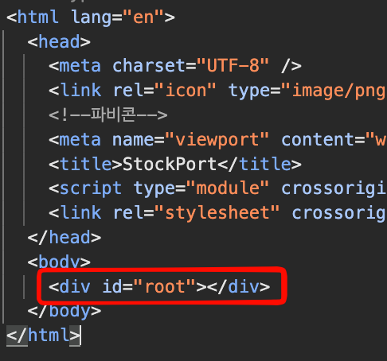
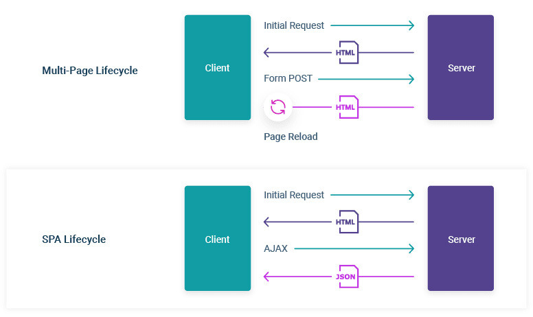
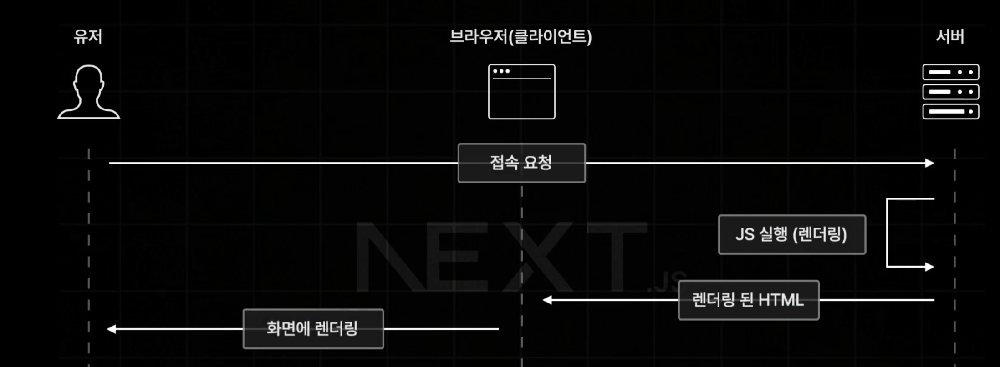

## 1 싱글 페이지 애플리케이션(SPA)

: 렌더링과 라우팅에 필요한 대부분의 기능을 브라우저의 자바스크립트에 의존하는 방식

- 최초 첫 페이지에서 데이터를 모두 불러옴
- 이후에는 페이지 전환을 위한 모든 작업이 자바스크립트, 브라우저로 이루어짐



SPA 사이트에 최초 접속시 받아온 html 소스 코드. body 태그 내부에 내용이 없다.

```js
createRoot(document.getElementById("root")!).render(
  <StrictMode>
    <App />
  </StrictMode>
);
```

리액트에선 이후 저 div 태그 내부에 JS를 통해 렌더링한다.

### 전통 방식과 싱글 페이지 애플리케이션의 작동 비교

1. 전통 방식
   1. 페이지 전환마다 서버에 새로운 페이지를 요청 후 html 페이지를 다운로드해 파싱
   2. 처음부터 페이지를 새로 그리기 때문에 부자연스럽다.
2. 싱글 페이지 애플리케이션
   1. 최초에 모든 리소스 다운로드 이후 추가 리소스 다운로드 필요 없음
   2. 이후에는 자바스크립트로 페이지 전환
   3. 전환이 필요한 일부 영역만 그리면 되므로 UI가 매끄러움

### 새로운 패러다임의 웹서비스를 향한 요구

일반적인 SPA 방식은 최초에 자바스크립트 파일을 모두 다운로드 한 이후 화면이 그려지므로, 사용자가 최초 페이지를 보기까지 시간이 많이 소요

웹서비스의 규모가 커지고 품질이 높아짐에 따라 자바스크립트 코드의 규모도 증가

→ 인터넷과 사용자의 기기의 발전에도 자바스크립트 리소스 처리 속도는 크게 향상되지 않음

## 2 서버 사이드 렌더링이란?



서버 사이드 렌더링: 최초에 사용자에게 보여줄 페이지를 서버에서 렌더링해 빠르게 사용자에게 화면을 제공하는 방식



### 서버 사이드 렌더링의 장점

1. 최초 페이지 진입(First Contentful Paint)이 비교적 빠르다.

   - 이미 서버에서 다 그려진 HTML을 보내주기 때문

2. 검색 엔진과 SNS 공유 등 메타데이터 제공이 쉽다.

   검색 엔진이 사이트에서 필요한 정보를 가져가는 과정

   1. 검색 엔진 로봇이 페이지에 진입
   2. 페이지가 HTML을 로봇에 제공한다. (JS 코드는 실행하지 않음)
   3. HTML 내부 정보를 기반으로 페이지의 정보를 가져오고, 검색 엔진에 저장한다.

   SPA의 경우 로봇이 페이지에 진입했을 때 가져가는 HTML 내부에 데이터가 없음 → 검색 엔진 최적화에 불리

3. 누적 레이아웃 이동(Cumulative Layout Shift)이 적다.

   누적 레이아웃 이동: 사용자에게 페이지를 보여준 이후에 데이터가 추가/삭제되어 화면이 튀는 현상

4. 사용자의 디바이스 성능에 비교적 자유롭다.
   자바스크립트 리소스 실행을 서버에 나눌 수 있으므로 다소 개선 가능
5. 보안에 좀 더 안전하다.

### 서버 사이드 렌더링의 단점

1. 소스코드를 작성할 때 항상 서버를 고려해야한다.
2. 적절한 서버가 구축돼 있어야 한다.
3. 서비스 지연에 따른 문제

### SSR과 SPA 방식(CSR) 모두를 알아야 하는 이유

- SPA여도 최초 페이지를 잘 보여주기 위한 최적화를 잘 해두면 SSR 못지 않다.
  (lazy loading, code splitting, 로딩 UI를 통한 CLS 처리 등)
- SSR의 페이지 요청 또한 최적화, 꼼수?를 사용하면 부드럽게 처리할 수 있다.
  라우팅 시 이전 화면 보여주기, 캐싱된 페이지 보여주기, 페이지 간 중복 요소는 유지하기

```toc

```
